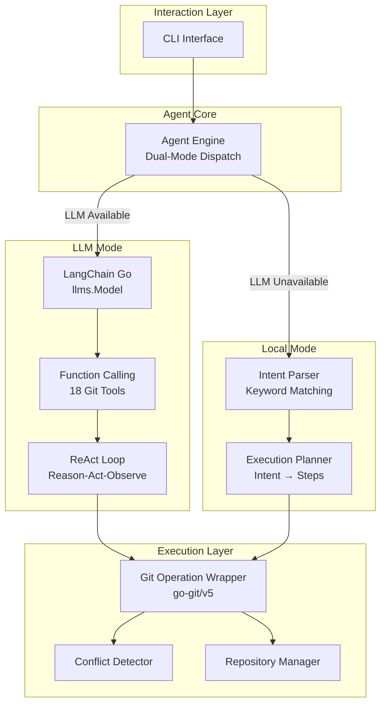
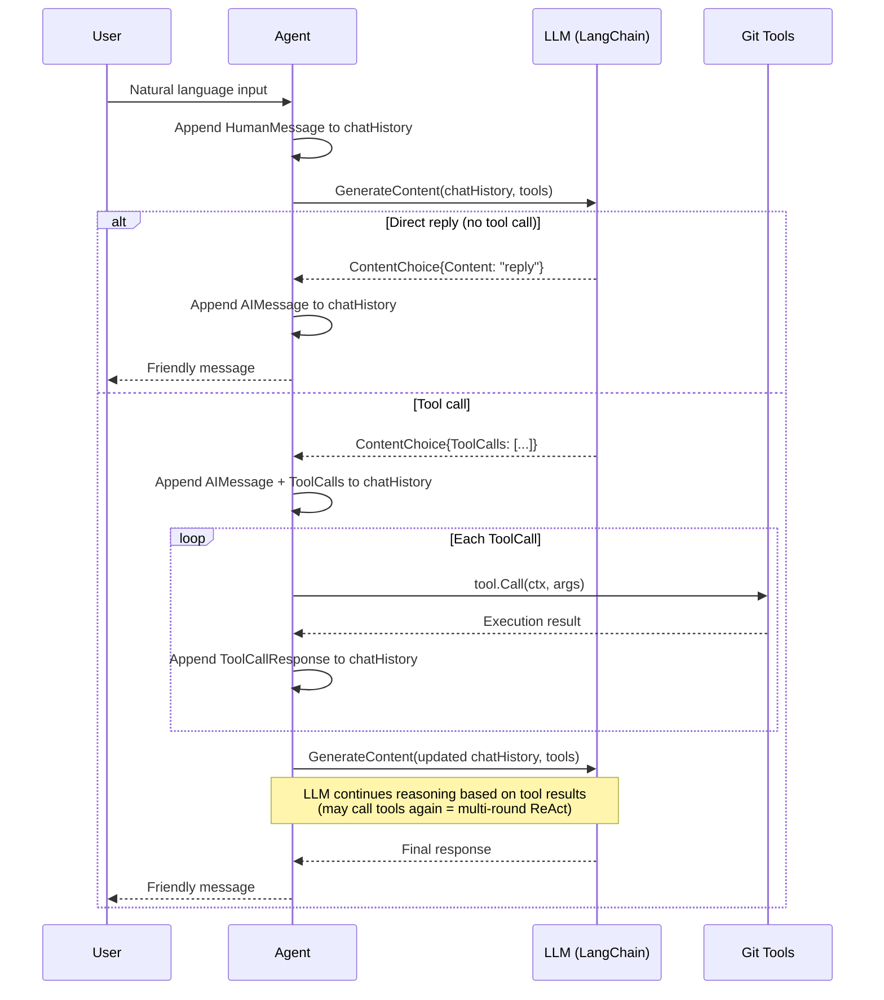
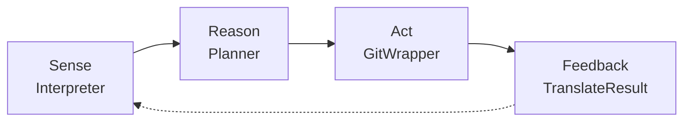
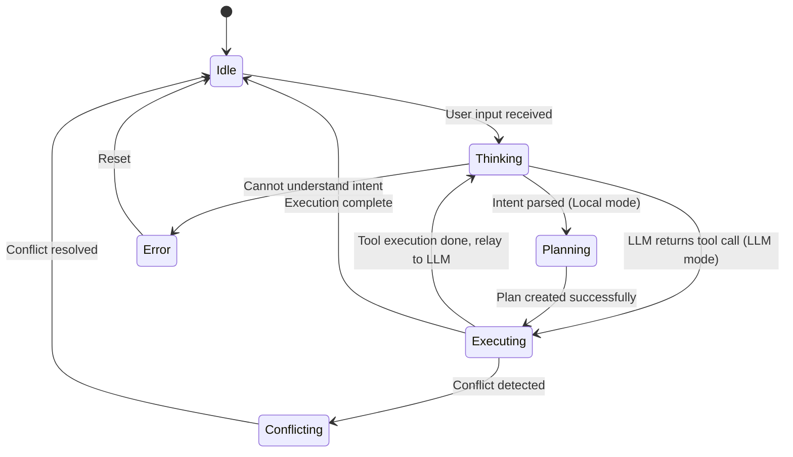
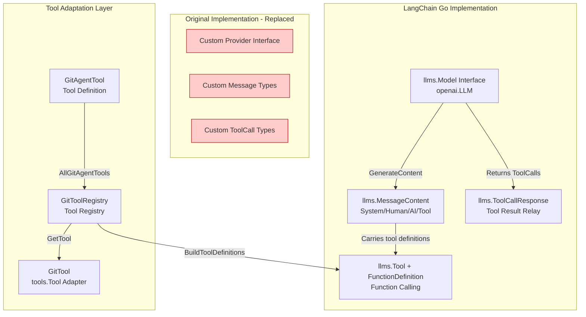
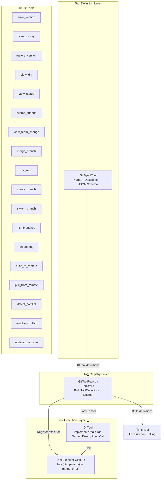
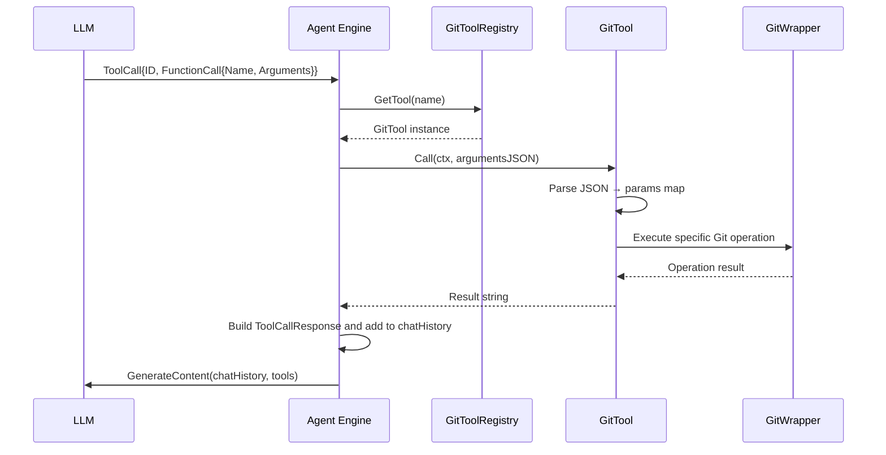

# Git Agent 🤖

> Empowering non-technical users to manage file versions as easily as using office software — no Git knowledge required.

[中文文档](README_zh.md) | [📖 Usage Guide](USAGE.md)

## Overview

Git Agent is a **natural language-driven file version management assistant** built in Go. Its core mission is to enable industry researchers, administrative staff, marketing professionals, and other non-technical users to manage file versions without ever learning `commit`, `branch`, `merge`, or any Git concepts. Simply describe what you want in natural language, and the Agent handles the rest.

The project supports **dual-mode operation**:

- 🧠 **LLM Mode**: Powered by [LangChain Go](https://github.com/tmc/langchaingo), it leverages large language models to understand user intent and executes Git operations via Function Calling + ReAct loops
- 📝 **Local Mode (fallback)**: Keyword-matching + hardcoded planning — works out of the box with no API key required

## Design Philosophy

1. **Zero Git Knowledge Required** — Users never need to learn any Git commands
2. **Natural Language Interaction** — Users express needs; the Agent translates them into Git operations
3. **Scenario-Driven Design** — Built around office scenarios (research reports, proposal documents, data files)
4. **Intelligent Conflict Handling** — Automatically detects and assists in resolving merge conflicts
5. **Graceful Degradation** — Falls back to local mode automatically when LLM is unavailable
6. **Smart Authentication Strategy** — New repos default to HTTPS + Token (beginner-friendly); existing repos preserve user's configured auth method; SSH auth auto-discovers `~/.ssh/config` IdentityFile
7. **Commit Message Discipline** — All commit messages are auto-generated in English with conventional commit style (feat:/fix:/docs:/refactor:/chore:)

## Architecture

### System Overview



### LLM Mode: ReAct Loop

The LLM mode adopts the **ReAct (Reasoning + Acting)** paradigm. In each conversation turn, the LLM autonomously decides whether to respond directly or invoke a tool, supporting multi-round tool calls:



### Local Mode: Sense-Reason-Act-Feedback



| Stage | Module | Responsibility |
|--------|---------|----------------|
| **Sense** | Interpreter | Parse natural language and identify user intent |
| **Reason** | Planner | Convert intent into a multi-step execution plan |
| **Act** | GitWrapper | Execute Git operations in the plan |
| **Feedback** | Interpreter | Translate execution results into user-friendly messages |

### Agent State Machine



## LangChain Go Integration

### Integration Architecture

The project integrates [LangChain Go v0.1.14](https://github.com/tmc/langchaingo), replacing the original custom LLM Provider implementation with standardized framework components:



### Core Migration Mapping

| Migration Item | Original Implementation | LangChain Go Implementation |
|----------------|------------------------|----------------------------|
| LLM Interface | `llm.Provider` | `llms.Model` (`openai.LLM`) |
| Conversation Context | `[]llm.Message` | `[]llms.MessageContent` |
| System Prompt | `SystemChatMessage{Content: ...}` | `TextParts(ChatMessageTypeSystem, ...)` |
| User Message | `HumanChatMessage{Content: ...}` | `TextParts(ChatMessageTypeHuman, ...)` |
| AI Message | `AIChatMessage{Content, ToolCalls}` | `MessageContent{Role: AI, Parts: [TextContent, ToolCall]}` |
| Tool Definition | `[]llm.Tool{Function: ...}` | `[]llms.Tool{Function: *FunctionDefinition}` |
| Tool Call | `ToolCall.Function.Name` | `ToolCall.FunctionCall.Name` (pointer type) |
| Tool Result Relay | `ToolChatMessage{ToolCallID, Name}` | `ToolCallResponse{ToolCallID, Name, Content}` |
| LLM Invocation | `provider.Chat(messages, tools)` | `llm.GenerateContent(ctx, messages, WithTools(...))` |
| Response Parsing | Iterate `choice.Parts` | `choice.Content` + `choice.ToolCalls` |

### Tool System Design

The LLM mode invokes Git operations via **Function Calling**. The tool system has three layers:



#### Tool Definition Example

```go
// GitAgentTool struct
type GitAgentTool struct {
    Name        string `json:"name"`
    Description string `json:"description"`
    Parameters  any    `json:"parameters"` // JSON Schema
}

// Example: save_version tool
GitAgentTool{
    Name:        "save_version",
    Description: "Save current file changes as a new version. Use after editing is complete.",
    Parameters: map[string]any{
        "type": "object",
        "properties": map[string]any{
            "message": map[string]any{
                "type":        "string",
                "description": "Commit message in English. Summarize the main purpose of ALL file changes. Use conventional commit style, e.g.: 'feat: add Ollama LLM support', 'fix: resolve merge conflict detection'",
            },
            "files": map[string]any{
                "type":        "string",
                "description": "File paths to save, comma-separated. Leave empty to save all changes",
            },
        },
        "required": []string{"message"},
    },
}
```

#### Tool Call Flow



## Project Structure

```
git-agent/
├── main.go                          # Entry point (interactive mode, LLM config)
├── internal/
│   ├── version.go                   # Version info with ASCII logo (injected via ldflags)
│   ├── agent/agent.go               # Agent core engine (dual-mode dispatch, ReAct loop, state management)
│   ├── llm/
│   │   ├── langchain.go             # LangChain LLM factory (openai.New adapter)
│   │   ├── git_tools.go             # Tool registry + GitTool adapter
│   │   ├── tools.go                 # 18 GitAgentTool definitions
│   │   ├── prompts.go               # System prompts (intent parsing, planning, conflict analysis)
│   │   └── provider.go              # Compatibility layer (Usage, OpenAIConfig type definitions)
│   ├── interpreter/interpreter.go   # Natural language intent parser (18 intents, param extraction, result translation)
│   ├── planner/planner.go           # Execution planner (intent → multi-step plan)
│   ├── gitwrapper/gitwrapper.go     # Git operation wrapper (high-level office-friendly API)
│   ├── conflict/conflict.go         # Conflict detection & resolution (scan, suggest, auto/manual resolve)
│   ├── repository/repository.go     # Repository management (create, clone, list)
│   └── storage/storage.go           # Storage layer
├── Makefile                         # Build automation with version injection
├── go.mod
└── go.sum
```

### Key Files

| File | Lines | Responsibility |
|------|-------|----------------|
| `main.go` | ~362 | Interactive CLI, LLM config, environment variables, mode switching |
| `agent/agent.go` | ~1341 | Agent core: dual-mode dispatch, LangChain integration, ReAct loop, tool registry, state management |
| `llm/langchain.go` | ~31 | LangChain LLM factory, supports OpenAI/DeepSeek/Azure etc. |
| `llm/git_tools.go` | ~118 | GitToolRegistry, GitTool adapter |
| `llm/tools.go` | ~302 | 18 GitAgentTool definitions (with JSON Schema params) |
| `llm/prompts.go` | ~199 | System prompt, intent parsing prompt, planning prompt, conflict analysis prompt |
| `llm/provider.go` | ~348 | Compatibility layer: Usage, OpenAIConfig type definitions |
| `internal/version.go` | ~39 | Version info with ASCII art logo, ldflags-injected variables |

## Module Details

### Interpreter — Intent Parser (Local Mode)

Parses natural language input into structured `UserIntent`, supporting **18 intents**:

| Intent | Natural Language Example | Git Operation |
|--------|--------------------------|---------------|
| `save_version` | "save my changes", "create a version" | `git add` + `git commit` |
| `view_history` | "show history", "view change log" | `git log` |
| `restore_version` | "restore yesterday's version", "go back" | `git checkout` |
| `view_diff` | "what changed?", "show differences" | `git diff` |
| `view_status` | "check status", "what's modified" | `git status` |
| `submit_change` | "submit to team", "push changes" | `git push` |
| `view_team_change` | "what did Alice change" | `git log --author` |
| `approve_merge` | "merge Bob's changes" | `git merge` |
| `init_repo` | "initialize repository" | `git init` |
| `create_branch` | "create a new branch" | `git branch` |
| `switch_branch` | "switch to report branch" | `git checkout` |
| `list_branches` | "list workspaces" | `git branch -a` |
| `create_tag` | "tag this version" | `git tag` |
| `push` | "push to remote" | `git push` |
| `pull` | "pull latest changes" | `git pull` |
| `resolve_conflict` | "resolve conflict" | Manual/auto merge |
| `update_user_info` | "my name is Alex" | Update user config |
| `help` | "help", "what can you do" | Help documentation |

**Parsing Strategy**: Multi-strategy keyword matching + match score ranking, selecting the highest-confidence intent.

### Planner — Execution Planner (Local Mode)

Converts intents into multi-step execution plans (`Plan`), where each step (`Step`) corresponds to an atomic operation:

```
Intent: save_version
  ↓
Plan:
  Step 1: git_add (Stage files) [required]
  Step 2: git_commit (Create commit) [required]
  Step 3: conflict_detect (Conflict detection) [optional]
```

### GitWrapper — Git Operation Wrapper

A comprehensive wrapper built on [go-git](https://github.com/go-git/go-git), providing **office-friendly high-level interfaces**:

| Method | Office Scenario Description | Underlying Git Command |
|--------|----------------------------|------------------------|
| `SaveVersion()` | Save a new version | `add` + `commit` |
| `GetHistory()` | View change history | `log` |
| `RestoreVersion()` | Restore a previous version | `checkout` |
| `RestoreFile()` | Restore a specific file to a previous version | `checkout` |
| `GetDiff()` | View changes | `diff` |
| `CommitDiff()` | View changes in a specific commit | `diff` (commit vs parent) |
| `GetStatus()` | Check current status | `status` |
| `GetAheadBehind()` | Check sync status with remote | `rev-list --left-right --count` |
| `SubmitChange()` | Submit to team | `push` |
| `PushWithAuth()` | Push with HTTPS authentication (username + token) | `push` with auth |
| `SetRemoteURL()` | Switch remote URL (e.g., SSH → HTTPS) | `remote set-url` |
| `GetTeamChange()` | View others' changes | `log --author` |
| `CreateBranch()` | Create a new work branch | `branch` |
| `SwitchBranch()` | Switch work branch | `checkout` |
| `MergeBranch()` | Merge changes | `merge` |
| `CreateTag()` | Tag a version | `tag` |

All Git concepts are translated into user-friendly office language through **data structures** and **method naming**:

- `commit` → `VersionInfo` (version info)
- `diff` → `FileChange` (file change)
- `status` → `StatusInfo` (status info)
- `branch` → `BranchInfo` (branch info)

### ConflictDetector — Conflict Detection & Resolution

- **Scan()** — Scan working directory for conflict markers (`<<<<<<<`, `=======`, `>>>>>>>`)
- **Resolve()** — Resolve conflicts by strategy (`ours` / `theirs` / `merge`)
- **AutoResolveSimpleConflicts()** — Automatically resolve simple conflicts
- **SuggestResolution()** — Provide resolution suggestions and confidence scores for complex conflicts

## Interaction Examples

### Example 1: LLM Mode — Save a New Report Version
```
🧠 > Save my changes, updated the market analysis report

  ✅ Saved as new version!
  💡 Submit to team | View change history
  Token: 256 (prompt: 180, completion: 76)
```

### Example 2: LLM Mode — View Change History
```
🧠 > View change history

  | ID | 提交 Hash | 提交人 | 时间 | 修改内容 |
  |-----|----------|--------|------|----------|
  | 1 | 5c1a42e1 | jackz | 2026-04-22 | feat: support viewing specific commit diff |
  | 2 | 32c99ffb | jackz | 2026-04-22 | docs: update help documentation and comments |
  | 3 | 684ac5d | jackz | 2026-04-22 | refactor: unify tool parameter passing |

  Token: 312 (prompt: 220, completion: 92)
```

### Example 3: LLM Mode — View Specific Commit Changes
```
🧠 > What changed in commit 5c1a42e1?

  📋 Changes in commit 5c1a42e1:
  File: agent.go | +45 -12
  File: tools.go | +18 -3

  Token: 289 (prompt: 195, completion: 94)
```

### Example 4: LLM Mode — Check Status with Sync Info
```
🧠 > Check status

  📋 Working tree clean
  | ID | 提交 Hash | 提交人 | 时间 | 修改内容 |
  |-----|----------|--------|------|----------|
  | 1 | 5c1a42e1 | jackz | 2026-04-22 | feat: support viewing specific commit diff |

  📡 Local is ahead of remote by 2 commits. Use "push" to sync.

  Token: 198 (prompt: 140, completion: 58)
```

### Example 5: LLM Mode — Set User Info
```
🧠 > My name is Alex and my email is alex@company.com

  ✅ User info updated: Alex <alex@company.com>

  Token: 145 (prompt: 120, completion: 25)
```

### Example 6: Local Mode — Handle Conflicts
```
📝 > Pull latest changes

⚠️ 1 conflict detected:
  📄 report.md: You and a colleague both modified the same section
  💡 Suggestion: The conflict area is simple, auto-merge recommended

📝 > Resolve the conflict using merge strategy

✅ Conflict resolved!
  📝 report.md: Both sets of changes have been auto-merged
  💡 You might also want to:
     • Save the merged result
     • Submit to team
```

## Quick Start

### Install

```bash
git clone <repo-url> git-agent
cd git-agent
go mod tidy
```

### Interactive Mode (Recommended)

**Local Mode** (no API key required):
```bash
make dev
# or: go run main.go
```

**LLM Mode** (API key required):
```bash
# OpenAI
go run main.go --api-key sk-xxx --model gpt-4o

# DeepSeek
go run main.go --api-key sk-xxx --base-url https://api.deepseek.com/v1 --model deepseek-chat

# Azure OpenAI
go run main.go --api-key YOUR_KEY --base-url https://YOUR.openai.azure.com/openai/deployments/YOUR_MODEL --model gpt-4o
```

After entering interactive mode:

```
Git Agent v0.1.0(abc1234)
  🧠 LLM gpt-4o @ api.openai.com

  输入「帮助」查看所有操作  输入「退出」结束会话


🧠 > _
```

### Build from Source

```bash
# Build with version info injected
make build

# Check version
./git-agent --version
```

Output:
```
  ____ ___ _____      _    ____ _____ _   _ _____ 
 / ___|_ _|_   _|    / \  / ___| ____| \ | |_   _|
| |  _ | |  | |     / _ \| |  _|  _| |  \| | | |  
| |_| || |  | |    / ___ \ |_| | |___| |\  | | |  
 \____|___| |_|   /_/   \_\____|_____|_| \_| |_|  
                                                  

Current version: v0.1.0
Commit hash: abc1234
Build time: 2026-04-22 10:00:00
```

### Makefile Commands

| Command | Description |
|---------|-------------|
| `make build` | Build binary with version info injected |
| `make run` | Build and run |
| `make dev` | Run directly in dev mode (no version injection) |
| `make version` | Build and display version info |
| `make clean` | Remove build artifacts |
| `make test` | Run tests |
| `make test-cover` | Run tests with coverage report |
| `make lint` | Run linter |
| `make tidy` | Tidy dependencies |
| `make install` | Install binary to GOPATH/bin |

### Command-Line Flags

| Flag | Description | Environment Variable |
|------|-------------|---------------------|
| `--api-key` | LLM API Key | `GIT_AGENT_API_KEY` |
| `--base-url` | LLM API Base URL | `GIT_AGENT_BASE_URL` |
| `--model` | LLM model name | `GIT_AGENT_MODEL` |
| `--repo` | Repository path (default `.`) | — |
| `--version` | Display version info | — |
| `--help` | Display help | — |

### Environment Variables

| Variable | Description | Default |
|----------|-------------|---------|
| `GIT_AGENT_API_KEY` | LLM API Key | — |
| `GIT_AGENT_BASE_URL` | LLM API endpoint | `https://api.openai.com/v1` |
| `GIT_AGENT_MODEL` | LLM model name | `gpt-4o` |
| `GIT_AGENT_MAX_TOKENS` | Max token limit | `4096` |
| `GIT_AGENT_USER` | Username (**required**) | — |
| `GIT_AGENT_EMAIL` | User email (**required**) | — |
| `GIT_HTTP_USERNAME` | HTTPS Git username (for push auth) | — |
| `GIT_HTTP_PASSWORD` | HTTPS Git password/token (for push auth) | — |

### Interactive Mode Commands

| Command | Description |
|---------|-------------|
| `/mode local` | Switch to local mode |
| `/mode llm` | Switch to LLM mode |
| `/clear` | Clear conversation history |
| `exit` / `quit` | Exit |

## Running Tests

```bash
make test
# or: go test ./...
```

## Roadmap

### Phase 1 — MVP ✅
- [x] Single-user version management
- [x] Natural language intent parser
- [x] Execution planner
- [x] Git operation wrapper (office-friendly API)
- [x] Conflict detection & resolution
- [x] Repository management
- [x] Interactive CLI

### Phase 2 — LLM Enhancement ✅
- [x] LangChain Go integration (v0.1.14)
- [x] Function Calling + ReAct loop
- [x] 18 Git tool definitions & registry
- [x] OpenAI / DeepSeek / Azure multi-model support
- [x] Automatic fallback to local mode on LLM failure
- [x] Conversation context management
- [x] Commit messages in English with conventional commit style
- [x] HTTPS authentication support for push operations

### Phase 3 — Team Collaboration 🚧
- [ ] Multi-user submission & review
- [ ] Web API (RESTful + WebSocket)
- [ ] Role-based access control (Editor, Viewer, Admin)

### Phase 4 — Advanced Features 📋
- [ ] LLM-powered intelligent conflict resolution suggestions
- [ ] Visual diff comparison web UI
- [ ] Office software plugin integration
- [ ] Cloud storage adapters (Google Drive, OneDrive, etc.)
- [ ] Audit logging

## Tech Stack

| Technology | Usage |
|------------|-------|
| **Go 1.24+** | Programming language |
| [go-git/v5](https://github.com/go-git/go-git) | Git operations (low-level) |
| [LangChain Go v0.1.14](https://github.com/tmc/langchaingo) | LLM framework (Function Calling, message management) |
| **Agent Loop** | Core architecture pattern (Sense → Reason → Act → Feedback) |
| **ReAct** | LLM reasoning pattern (Reasoning + Acting loop) |

---

**Core Value**: Transform powerful Git version control into an accessible daily tool for office workers, lowering the barrier to team collaboration and improving document management efficiency.
