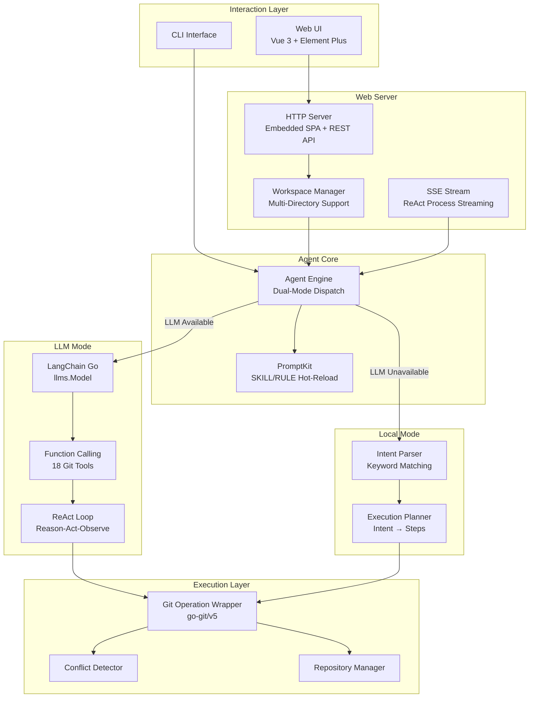
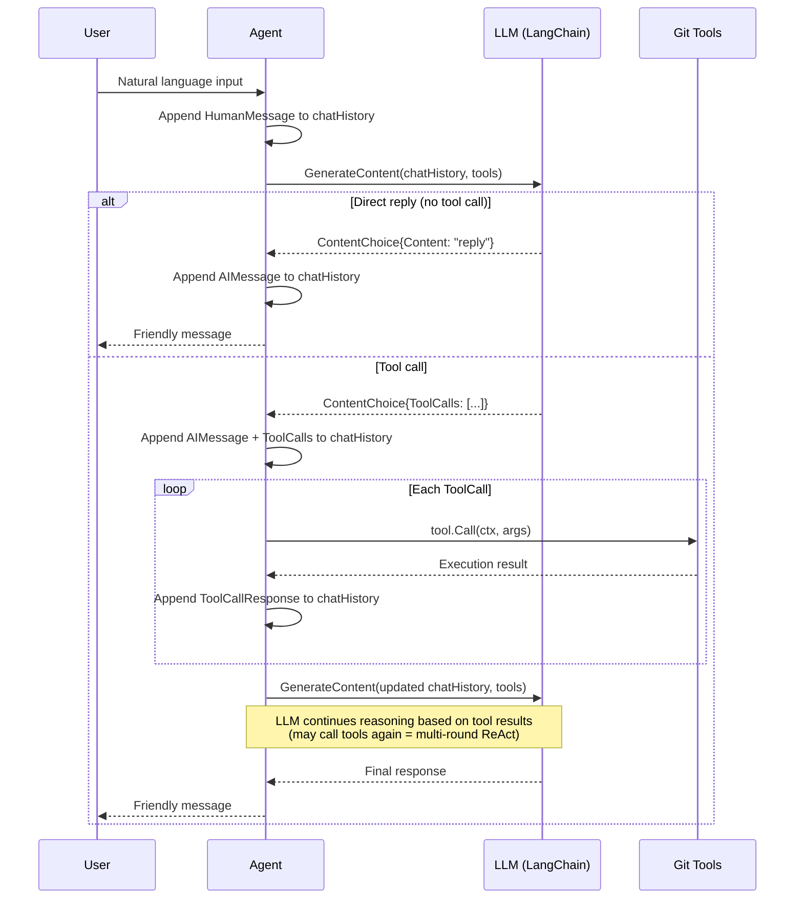
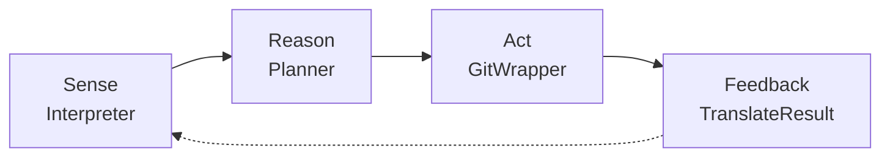
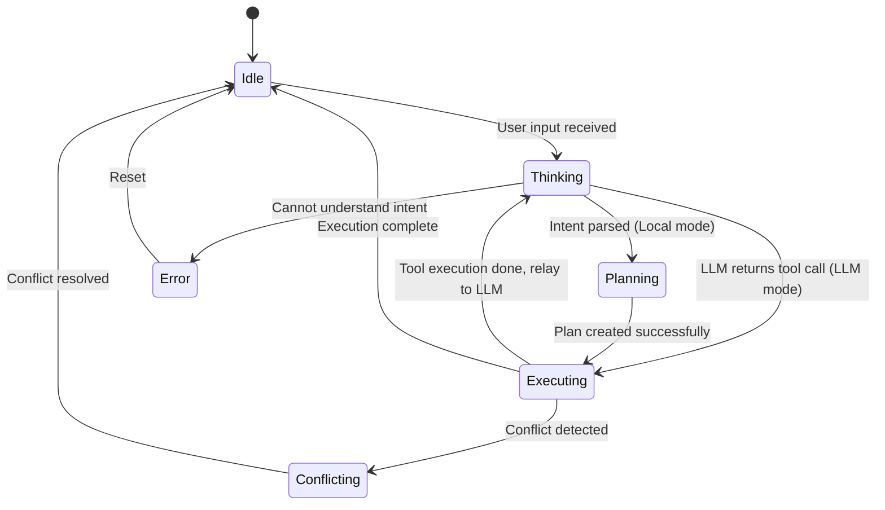

# Git Agent 🤖

> Empowering non-technical users to manage file versions as easily as using office software — no Git knowledge required.

[中文文档](README_zh.md) | [📖 Usage Guide](docs/USAGE.md) | [🔧 Tuning Guide](docs/TUNING_en.md) | [🌐 Web Mode](docs/web-mode_en.md)

## Overview

Git Agent is a **natural language-driven file version management assistant** built in Go. Its core mission is to enable industry researchers, administrative staff, marketing professionals, and other non-technical users to manage file versions without ever learning `commit`, `branch`, `merge`, or any Git concepts. Simply describe what you want in natural language, and the Agent handles the rest.

The project supports **dual-mode operation**:

- 🧠 **LLM Mode**: Powered by [LangChain Go](https://github.com/tmc/langchaingo), it leverages large language models to understand user intent and executes Git operations via Function Calling + ReAct loops
- 📝 **Local Mode (fallback)**: Keyword-matching + hardcoded planning — works out of the box with no API key required

And **dual-interface access**:

- 💻 **CLI Mode**: Interactive command-line interface for terminal users
- 🌐 **Web Mode**: Modern browser-based UI with file tree, status panels, history view, branch management, and an AI chat assistant — ideal for users who prefer graphical interfaces

## Design Philosophy

1. **Zero Git Knowledge Required** — Users never need to learn any Git commands
2. **Natural Language Interaction** — Users express needs; the Agent translates them into Git operations
3. **Scenario-Driven Design** — Built around office scenarios (research reports, proposal documents, data files)
4. **Intelligent Conflict Handling** — Automatically detects and assists in resolving merge conflicts
5. **Graceful Degradation** — Falls back to local mode automatically when LLM is unavailable
6. **Smart Authentication Strategy** — New repos default to HTTPS + Token (beginner-friendly); existing repos preserve user's configured auth method; SSH auth auto-discovers `~/.ssh/config` IdentityFile
7. **Commit Message Discipline** — All commit messages are auto-generated in English with conventional commit style (feat:/fix:/docs:/refactor:/chore:)
8. **SKILL/RULE Hot-Reload** — Prompt engineering via Markdown files with per-intent loading and live reload

## Architecture

### System Overview


```mermaid
graph TB
    subgraph interaction[Interaction Layer]
        CLI[CLI Interface]
        WebUI[Web UI<br/>Vue 3 + Element Plus]
    end

    subgraph web_server[Web Server]
        HTTP[HTTP Server<br/>Embedded SPA + REST API]
        SSE[SSE Stream<br/>ReAct Process Streaming]
        WS_MGR[Workspace Manager<br/>Multi-Directory Support]
    end

    subgraph core[Agent Core]
        AgentCore[Agent Engine<br/>Dual-Mode Dispatch]
        PromptKit[PromptKit<br/>SKILL/RULE Hot-Reload]
    end

    subgraph llm_mode[LLM Mode]
        LC[LangChain Go<br/>llms.Model]
        FC[Function Calling<br/>18 Git Tools]
        ReAct[ReAct Loop<br/>Reason-Act-Observe]
    end

    subgraph local_mode[Local Mode]
        Interpreter[Intent Parser<br/>Keyword Matching]
        Planner[Execution Planner<br/>Intent → Steps]
    end

    subgraph execution[Execution Layer]
        GitWrapper[Git Operation Wrapper<br/>go-git/v5]
        ConflictDetector[Conflict Detector]
        RepoManager[Repository Manager]
    end

    CLI --> AgentCore
    WebUI --> HTTP
    HTTP --> WS_MGR
    WS_MGR --> AgentCore
    SSE --> AgentCore
    AgentCore --> PromptKit
    AgentCore -->|LLM Available| LC
    LC --> FC
    FC --> ReAct
    AgentCore -->|LLM Unavailable| Interpreter
    Interpreter --> Planner
    ReAct --> GitWrapper
    Planner --> GitWrapper
    GitWrapper --> ConflictDetector
    GitWrapper --> RepoManager
```

### LLM Mode: ReAct Loop

The LLM mode adopts the **ReAct (Reasoning + Acting)** paradigm. In each conversation turn, the LLM autonomously decides whether to respond directly or invoke a tool, supporting multi-round tool calls:


```mermaid
sequenceDiagram
    participant U as User
    participant A as Agent
    participant L as LLM (LangChain)
    participant T as Git Tools

    U->>A: Natural language input
    A->>A: Append HumanMessage to chatHistory
    A->>L: GenerateContent(chatHistory, tools)
    alt Direct reply (no tool call)
        L-->>A: ContentChoice{Content: "reply"}
        A->>A: Append AIMessage to chatHistory
        A-->>U: Friendly message
    else Tool call
        L-->>A: ContentChoice{ToolCalls: [...]}
        A->>A: Append AIMessage + ToolCalls to chatHistory
        loop Each ToolCall
            A->>T: tool.Call(ctx, args)
            T-->>A: Execution result
            A->>A: Append ToolCallResponse to chatHistory
        end
        A->>L: GenerateContent(updated chatHistory, tools)
        Note over A,L: LLM continues reasoning based on tool results<br/>(may call tools again = multi-round ReAct)
        L-->>A: Final response
        A-->>U: Friendly message
    end
```

### Local Mode: Sense-Reason-Act-Feedback


```mermaid
graph LR
    A[Sense<br/>Interpreter] --> B[Reason<br/>Planner]
    B --> C[Act<br/>GitWrapper]
    C --> D[Feedback<br/>TranslateResult]
    D -.-> A
```

| Stage | Module | Responsibility |
|--------|---------|----------------|
| **Sense** | Interpreter | Parse natural language and identify user intent |
| **Reason** | Planner | Convert intent into a multi-step execution plan |
| **Act** | GitWrapper | Execute Git operations in the plan |
| **Feedback** | Interpreter | Translate execution results into user-friendly messages |

### Agent State Machine


```mermaid
stateDiagram-v2
    [*] --> Idle
    Idle --> Thinking: User input received
    Thinking --> Planning: Intent parsed (Local mode)
    Thinking --> Executing: LLM returns tool call (LLM mode)
    Thinking --> Error: Cannot understand intent
    Planning --> Executing: Plan created successfully
    Executing --> Conflicting: Conflict detected
    Executing --> Thinking: Tool execution done, relay to LLM
    Executing --> Idle: Execution complete
    Conflicting --> Idle: Conflict resolved
    Error --> Idle: Reset
```

## Web UI

The Web UI provides a modern, graphical interface for managing file versions:

- **Home Page**: Open local directories via system file picker or recent history
- **Workspace View**: File tree (left), functional panels (right — Status / History / Branches), AI chat assistant (right drawer)
- **Settings Page**: Configure user info, LLM API, and HTTP credentials
- **Multi-Workspace**: Open and switch between multiple directories simultaneously

### Key Features

| Feature | Description |
|---------|-------------|
| **File Tree** | Browse workspace files with syntax-highlighted preview |
| **Status Panel** | View modified/new/deleted files, multi-select commit, one-click save |
| **History Panel** | Filter commits by author/keyword, view diffs, rollback |
| **Branch Panel** | Switch/create branches, push to remote |
| **AI Chat** | Right-side drawer with collapsible ReAct reasoning steps, quick actions, streaming responses |
| **Settings** | Persistent config at `~/.git-agent/config.json`, LLM test connection |
| **Audit Log** | Destructive operations logged to `~/.git-agent/logs/ops.log` |

For detailed Web mode documentation, see [docs/web-mode.md](docs/web-mode.md).

## SKILL/RULE System

The prompt engineering system uses **Markdown files** with per-intent loading and hot-reload:

```
internal/promptkit/resources/     ← Built-in (embedded)
├── skills/                       ← Operation knowledge (per-intent)
│   ├── batch-commit.md
│   ├── conflict-resolution.md
│   └── push-fail-guide.md
└── rules/                        ← Behavior constraints
    ├── always-execute.md
    ├── commit-message.md
    ├── display-format.md
    ├── no-git-terms.md
    ├── no-repeat-tools.md
    └── version-restore.md

~/.config/git-agent/              ← User-level overrides
.git-agent/                       ← Project-level overrides (team-shared)
```

**Override priority**: Built-in < User-level < Project-level

For details on tuning and customization, see [docs/TUNING.md](docs/TUNING.md).

## Project Structure

```
git-agent/
├── main.go                          # Entry point (CLI interactive mode, subcommand dispatch)
├── serve.go                         # Web serve subcommand (config merge, signal handling)
├── .air.toml                        # Air hot-reload config (dev mode only)
├── Makefile                         # Build automation (frontend + backend, dev mode, version injection)
├── internal/
│   ├── version.go                   # Version info with ASCII logo (injected via ldflags)
│   ├── agent/
│   │   ├── agent.go                 # Agent core engine (dual-mode dispatch, ReAct loop, state management)
│   │   └── events.go               # SSE event types for Web streaming
│   ├── llm/
│   │   ├── langchain.go            # LangChain LLM factory (openai.New adapter)
│   │   ├── git_tools.go            # Tool registry + GitTool adapter
│   │   ├── tools.go                # 18 GitAgentTool definitions (JSON Schema params)
│   │   └── provider.go             # Compatibility layer (Usage, OpenAIConfig types)
│   ├── promptkit/
│   │   ├── promptkit.go            # SKILL/RULE loader (embed + filesystem, hot-reload via fsnotify)
│   │   ├── embed.go                # Embedded resources FS
│   │   └── resources/              # Built-in Skills & Rules (Markdown)
│   ├── interpreter/interpreter.go  # Natural language intent parser (18 intents, scoring, negation)
│   ├── planner/planner.go          # Execution planner (intent → multi-step plan)
│   ├── gitwrapper/gitwrapper.go    # Git operation wrapper (office-friendly high-level API)
│   ├── conflict/conflict.go        # Conflict detection & resolution
│   ├── repository/repository.go    # Repository management (create, clone, list)
│   └── web/
│       ├── server.go               # HTTP server lifecycle (listen, graceful shutdown)
│       ├── routes.go               # API route registration
│       ├── workspace.go            # Workspace manager (multi-directory, Agent lifecycle)
│       ├── handlers_agent_stream.go # SSE streaming for ReAct process
│       ├── handlers_readonly.go    # Read-only API (status, history, diff, branches, file content)
│       ├── handlers_write.go       # Write API (commit, push, pull, branch, tag, init)
│       ├── handlers_settings.go    # Settings API (config CRUD, LLM test)
│       ├── handlers_browse.go      # File system browsing API
│       ├── config.go               # Persistent config store (~/.git-agent/config.json)
│       ├── recent.go               # Recent directories store
│       ├── audit.go                # Audit logger for destructive operations
│       ├── embed.go                # Frontend dist embedding
│       ├── pathcheck.go            # Path traversal protection
│       └── safepath.go             # System directory blocklist
├── web/                             # Frontend (Vue 3 + TypeScript + Element Plus)
│   ├── src/
│   │   ├── App.vue                 # Root component with CSS variables
│   │   ├── main.ts                 # Vue app bootstrap
│   │   ├── router.ts              # Vue Router (Home / Workspace / Settings)
│   │   ├── api/                   # API client (fetch + SSE streaming)
│   │   ├── stores/                # Pinia stores (workspaces, agentChat)
│   │   ├── views/                 # Page views (Home, Workspace, Settings)
│   │   └── components/workspace/  # Workspace components (FileTree, StatusPanel, etc.)
│   ├── vite.config.ts             # Vite config (proxy /api → :8088)
│   └── package.json               # Frontend dependencies
├── docs/
│   ├── USAGE.md                   # User guide (English)
│   ├── USAGE_zh.md                # User guide (Chinese)
│   ├── TUNING.md                  # Developer tuning guide
│   ├── web-mode.md                # Web mode guide
│   └── agent-dev-walkthrough.md   # Agent development walkthrough
├── go.mod
└── go.sum
```

## Quick Start

### Prerequisites

- **Go 1.24+** — [Download](https://go.dev/dl/)
- **Node.js 18+** — [Download](https://nodejs.org/) (only needed for frontend build)

### Install

```bash
git clone <repo-url> git-agent
cd git-agent
go mod tidy
```

### Option 1: Web Mode (Recommended)

```bash
# Build frontend + backend, then start Web server
make build
./git-agent serve

# Or with custom port
./git-agent serve --port 9000
```

Open `http://127.0.0.1:8088` in your browser. The UI will guide you through opening a directory and managing versions.

### Option 2: CLI Mode

**Local Mode** (no API key required):
```bash
make dev
# or: go run main.go
```

**LLM Mode** (API key required):
```bash
# OpenAI
go run main.go --api-key sk-xxx --model gpt-4o

# DeepSeek
go run main.go --api-key sk-xxx --base-url https://api.deepseek.com/v1 --model deepseek-chat

# Azure OpenAI
go run main.go --api-key YOUR_KEY --base-url https://YOUR.openai.azure.com/openai/deployments/YOUR_MODEL --model gpt-4o

# Local Ollama (free, offline)
go run main.go --api-key ollama --base-url http://localhost:11434/v1 --model qwen2.5:7b
```

### Build from Source

```bash
# Full build (frontend + Go, version injected)
make build

# Check version
./git-agent --version
```

## Development

### Dev Mode (Hot Reload)

The project supports **hot reload for both frontend and backend** during development:

```bash
# Install air for Go hot-reload (one-time)
go install github.com/air-verse/air@latest

# Option A: Two terminals
make dev-server   # Terminal 1: Backend (auto-restart on .go changes)
make dev-web      # Terminal 2: Frontend (Vite HMR on .vue/.ts changes)

# Option B: One terminal
make dev-all      # Starts both frontend and backend with hot-reload
```

Access `http://localhost:5173` for the dev frontend (proxies `/api` to backend `:8088`).

### Makefile Commands

| Command | Description |
|---------|-------------|
| `make build` | Build binary (frontend + Go, version injected) |
| `make build-web` | Build frontend only to `internal/web/dist/` |
| `make build-go-only` | Build Go binary only (skip frontend) |
| `make serve` | Build and start Web server |
| `make run` | Build and run CLI mode |
| `make dev` | Run CLI in dev mode (no version injection) |
| `make dev-web` | Start frontend dev server (port 5173, HMR) |
| `make dev-server` | Start backend dev server (port 8088, air hot-reload) |
| `make dev-all` | Start both frontend and backend with hot-reload |
| `make version` | Build and display version info |
| `make test` | Run tests |
| `make test-cover` | Run tests with coverage report |
| `make lint` | Run linter |
| `make tidy` | Tidy dependencies |
| `make clean` | Remove build artifacts |
| `make install` | Install binary to GOPATH/bin |

### Command-Line Flags

| Flag | Description | Environment Variable |
|------|-------------|---------------------|
| `--api-key` | LLM API Key | `GIT_AGENT_API_KEY` |
| `--base-url` | LLM API Base URL | `GIT_AGENT_BASE_URL` |
| `--model` | LLM model name | `GIT_AGENT_MODEL` |
| `--repo` | Repository path (default `.`) | — |
| `--version` | Display version info | — |
| `--help` | Display help | — |

### Serve Subcommand Flags

| Flag | Description | Default |
|------|-------------|---------|
| `--port` | Web server port | `8088` |
| `--host` | Listen address | `127.0.0.1` |
| `--open` | Auto-open browser | `true` |
| `--i-know-what-i-do` | Allow LAN access | `false` |

### Environment Variables

| Variable | Description | Default |
|----------|-------------|---------|
| `GIT_AGENT_API_KEY` | LLM API Key | — |
| `GIT_AGENT_BASE_URL` | LLM API endpoint | `https://api.openai.com/v1` |
| `GIT_AGENT_MODEL` | LLM model name | `gpt-4o` |
| `GIT_AGENT_MAX_TOKENS` | Max token limit | `4096` |
| `GIT_AGENT_USER` | Username (**required**) | — |
| `GIT_AGENT_EMAIL` | User email (**required**) | — |
| `GIT_HTTP_USERNAME` | HTTPS Git username (for push auth) | — |
| `GIT_HTTP_PASSWORD` | HTTPS Git password/token (for push auth) | — |

## Roadmap

### Phase 1 — MVP ✅
- [x] Single-user version management
- [x] Natural language intent parser (18 intents)
- [x] Execution planner
- [x] Git operation wrapper (office-friendly API)
- [x] Conflict detection & resolution
- [x] Repository management
- [x] Interactive CLI

### Phase 2 — LLM Enhancement ✅
- [x] LangChain Go integration (v0.1.14)
- [x] Function Calling + ReAct loop (multi-iteration)
- [x] 18 Git tool definitions & registry
- [x] OpenAI / DeepSeek / Azure / Ollama multi-model support
- [x] Automatic fallback to local mode on LLM failure
- [x] Conversation context management
- [x] Commit message quality assurance (dual-layer validation)
- [x] HTTPS authentication support for push operations
- [x] SKILL/RULE hot-reload prompt system (PromptKit)

### Phase 3 — Web UI ✅
- [x] Embedded Web server (`go embed` + SPA)
- [x] File tree browser with syntax-highlighted preview
- [x] Status / History / Branch panels
- [x] AI chat assistant with streaming ReAct visualization
- [x] Multi-workspace support
- [x] Settings page (user info, LLM config, HTTP auth)
- [x] Persistent config (`~/.git-agent/config.json`)
- [x] Audit logging for destructive operations
- [x] Frontend hot-reload (Vite HMR) + Backend hot-reload (air)

### Phase 4 — Team Collaboration 🚧
- [ ] Multi-user submission & review
- [ ] Role-based access control (Editor, Viewer, Admin)

### Phase 5 — Advanced Features 📋
- [ ] LLM-powered intelligent conflict resolution suggestions
- [ ] Visual diff comparison in Web UI
- [ ] Office software plugin integration
- [ ] Cloud storage adapters (Google Drive, OneDrive, etc.)

## Tech Stack

| Technology | Usage |
|------------|-------|
| **Go 1.24+** | Backend language |
| [go-git/v5](https://github.com/go-git/go-git) | Git operations (low-level) |
| [LangChain Go v0.1.14](https://github.com/tmc/langchaingo) | LLM framework (Function Calling, message management) |
| **Vue 3 + TypeScript** | Frontend framework |
| **Element Plus** | UI component library |
| **Vite** | Frontend build tool (HMR in dev) |
| **Pinia** | Frontend state management |
| [air](https://github.com/air-verse/air) | Go backend hot-reload (dev mode) |
| **Agent Loop** | Core architecture pattern (Sense → Reason → Act → Feedback) |
| **ReAct** | LLM reasoning pattern (Reasoning + Acting loop) |

## Documentation

| Document | Description |
|----------|-------------|
| [README.md](README.md) | Project overview (English) |
| [README_zh.md](README_zh.md) | Project overview (Chinese) |
| [docs/USAGE.md](docs/USAGE.md) | User guide (English) |
| [docs/USAGE_zh.md](docs/USAGE_zh.md) | User guide (Chinese) |
| [docs/TUNING_en.md](docs/TUNING_en.md) | Developer tuning guide (English) |
| [docs/TUNING.md](docs/TUNING.md) | Developer tuning guide (Chinese) |
| [docs/web-mode_en.md](docs/web-mode_en.md) | Web mode guide (English) |
| [docs/web-mode.md](docs/web-mode.md) | Web mode guide (Chinese) |
| [docs/agent-dev-walkthrough.md](docs/agent-dev-walkthrough.md) | Agent development walkthrough |

---

**Core Value**: Transform powerful Git version control into an accessible daily tool for office workers, lowering the barrier to team collaboration and improving document management efficiency.
