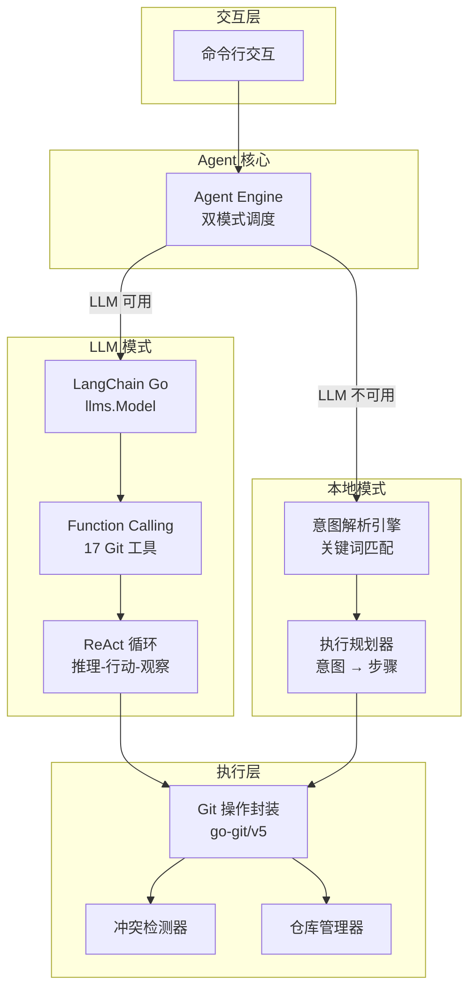
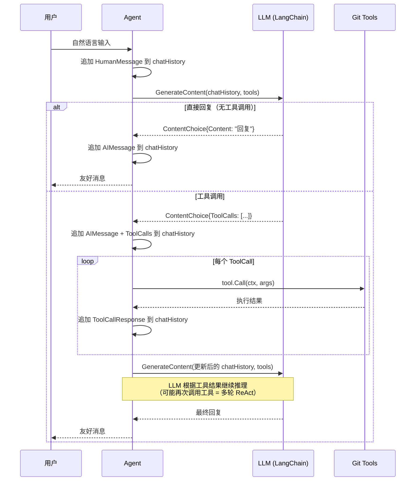
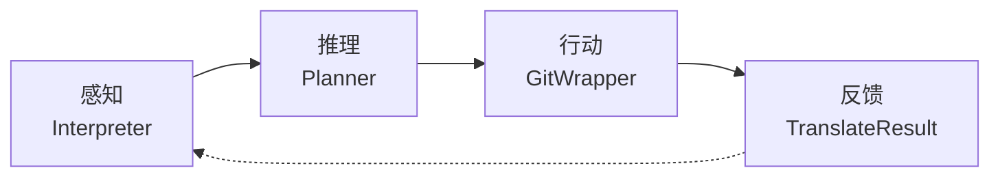
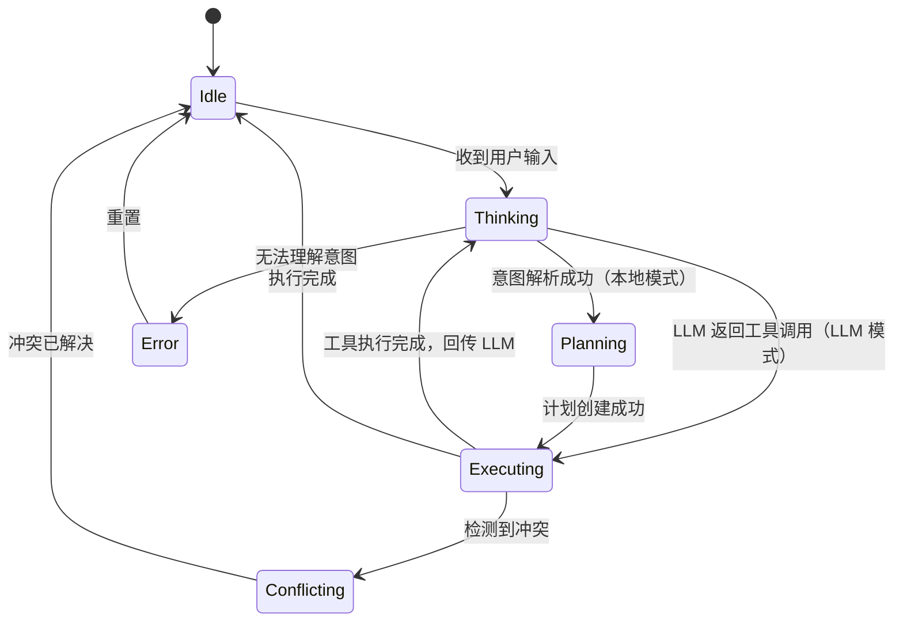
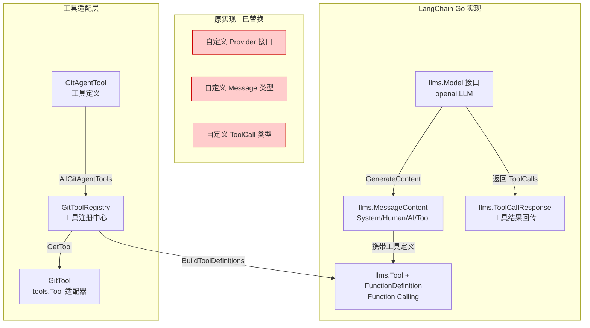
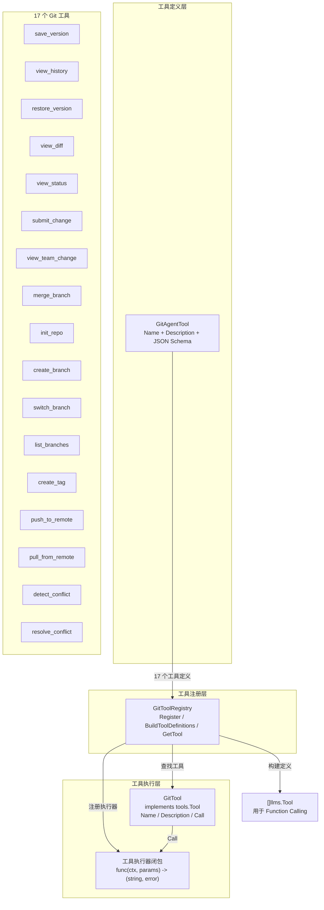
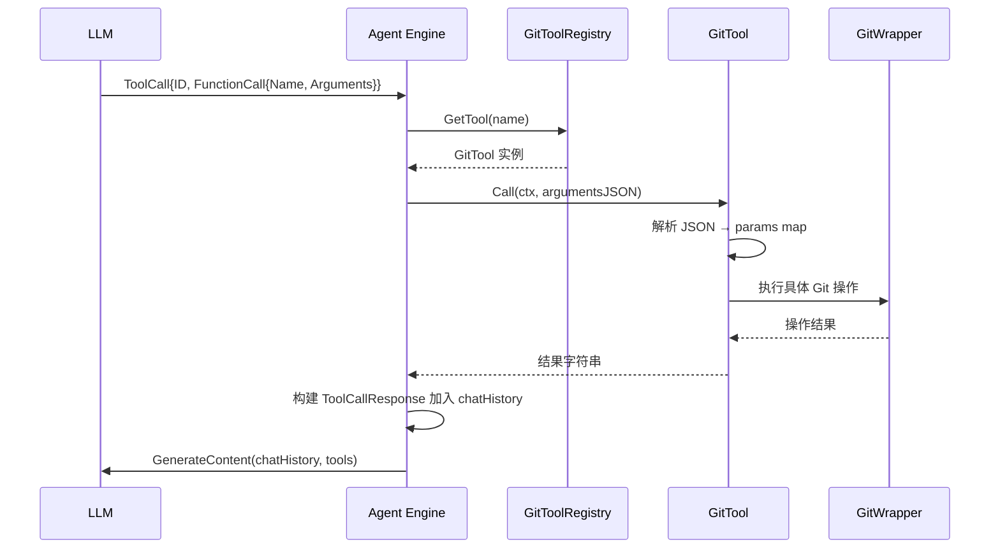

# Git Agent 🤖

[English](README.md) | 中文 | [📖 使用指南](USAGE_zh.md)

> 让完全不懂 git 的普通用户，也能像使用办公软件一样管理文件版本。

## 项目概述

Git Agent 是一个用 Go 语言实现的 **自然语言驱动的文件版本管理助手**。它的核心目标是让行业研究员、行政人员、市场人员等非技术用户，无需了解 `commit`、`branch`、`merge` 等 git 概念，只需用自然语言描述需求，Agent 就会自动完成对应的版本控制操作。

项目支持 **双模式运行**：

- 🧠 **LLM 模式**：基于 [LangChain Go](https://github.com/tmc/langchaingo) 框架，通过大语言模型理解用户意图，使用 Function Calling + ReAct 循环智能执行 Git 操作
- 📝 **本地模式（fallback）**：基于关键词匹配 + 硬编码规划，无需 API Key 即可使用

## 设计哲学

1. **零 Git 知识门槛** — 用户完全不需要了解任何 git 命令
2. **自然语言交互** — 用户说需求，Agent 自动转换为 git 操作
3. **场景化操作** — 基于办公场景（研究报告、方案文档、数据文件）设计交互
4. **智能冲突处理** — 自动检测并协助解决多人编辑冲突
5. **优雅降级** — LLM 不可用时自动回退到本地模式
6. **智能认证策略** — 新仓库默认 HTTPS + 令牌（对新手友好）；已有仓库保持用户已配置的认证方式；SSH 认证自动读取 `~/.ssh/config` 中的 IdentityFile

## 架构设计

### 整体架构



### LLM 模式：ReAct 循环

LLM 模式采用 **ReAct（Reasoning + Acting）** 范式，LLM 在每轮对话中可以自主决定是直接回复还是调用工具，支持多轮工具调用：



### 本地模式：感知-推理-行动-反馈



| 阶段 | 模块 | 职责 |
|------|------|------|
| **感知** | Interpreter | 解析自然语言，识别用户意图 |
| **推理** | Planner | 将意图转化为多步骤执行计划 |
| **行动** | GitWrapper | 执行计划中的 git 操作 |
| **反馈** | Interpreter | 将执行结果翻译为用户友好的消息 |

### Agent 状态机



## LangChain Go 集成设计

### 集成架构

项目集成了 [LangChain Go v0.1.14](https://github.com/tmc/langchaingo)，替换了原有的自定义 LLM Provider 实现，使用标准化的框架组件：



### 核心改造映射

| 改造项 | 原实现 | LangChain Go 实现 |
|--------|--------|-------------------|
| LLM 接口 | `llm.Provider` | `llms.Model`（`openai.LLM`） |
| 对话上下文 | `[]llm.Message` | `[]llms.MessageContent` |
| 系统提示词 | `SystemChatMessage{Content: ...}` | `TextParts(ChatMessageTypeSystem, ...)` |
| 用户消息 | `HumanChatMessage{Content: ...}` | `TextParts(ChatMessageTypeHuman, ...)` |
| AI 消息 | `AIChatMessage{Content, ToolCalls}` | `MessageContent{Role: AI, Parts: [TextContent, ToolCall]}` |
| 工具定义 | `[]llm.Tool{Function: ...}` | `[]llms.Tool{Function: *FunctionDefinition}` |
| 工具调用 | `ToolCall.Function.Name` | `ToolCall.FunctionCall.Name`（指针类型） |
| 工具结果回传 | `ToolChatMessage{ToolCallID, Name}` | `ToolCallResponse{ToolCallID, Name, Content}` |
| LLM 调用 | `provider.Chat(messages, tools)` | `llm.GenerateContent(ctx, messages, WithTools(...))` |
| 响应解析 | 遍历 `choice.Parts` | `choice.Content` + `choice.ToolCalls` |

### 工具系统设计

LLM 模式通过 **Function Calling** 机制调用 Git 操作，工具系统分为三层：



#### 工具定义示例

```go
// GitAgentTool 结构体
type GitAgentTool struct {
    Name        string `json:"name"`
    Description string `json:"description"`
    Parameters  any    `json:"parameters"` // JSON Schema
}

// 示例：save_version 工具
GitAgentTool{
    Name:        "save_version",
    Description: "保存当前文件修改为新版本。用户完成编辑后使用此功能保存。",
    Parameters: map[string]any{
        "type": "object",
        "properties": map[string]any{
            "message": map[string]any{
                "type":        "string",
                "description": "版本描述，例如：更新了市场分析报告",
            },
            "files": map[string]any{
                "type":        "string",
                "description": "要保存的文件路径，多个用逗号分隔。留空表示保存所有修改",
            },
        },
        "required": []string{"message"},
    },
}
```

#### 工具调用流程



## 代码结构

```
git-agent/
├── main.go                          # 主程序入口（交互模式、LLM 配置）
├── internal/
│   ├── version.go                   # 版本信息与 ASCII Logo（通过 ldflags 注入）
│   ├── agent/agent.go               # Agent 核心引擎（双模式调度、ReAct 循环、状态管理）
│   ├── llm/
│   │   ├── langchain.go             # LangChain LLM 工厂（openai.New 适配）
│   │   ├── git_tools.go             # 工具注册中心 + GitTool 适配器
│   │   ├── tools.go                 # 17 个 GitAgentTool 定义
│   │   ├── prompts.go               # 系统提示词（SystemPrompt、意图解析、规划、冲突分析）
│   │   └── provider.go              # 兼容保留（Usage、OpenAIConfig 等类型定义）
│   ├── interpreter/interpreter.go   # 自然语言意图解析（16种意图、参数提取、结果翻译）
│   ├── planner/planner.go           # 执行规划器（意图 → 多步骤计划）
│   ├── gitwrapper/gitwrapper.go     # Git 操作封装（面向办公场景的高层接口）
│   ├── conflict/conflict.go         # 冲突检测与解决（扫描、建议、自动/手动解决）
│   ├── repository/repository.go     # 仓库管理（创建、克隆、列表）
│   └── storage/storage.go           # 存储层
├── Makefile                         # 构建自动化脚本（含版本信息注入）
├── go.mod
└── go.sum
```

### 核心文件说明

| 文件 | 行数 | 职责 |
|------|------|------|
| `main.go` | ~318 | 交互式 CLI、LLM 配置、环境变量、模式切换 |
| `agent/agent.go` | ~956 | Agent 核心：双模式调度、LangChain 集成、ReAct 循环、工具注册、状态管理 |
| `llm/langchain.go` | ~31 | LangChain LLM 工厂，支持 OpenAI/DeepSeek/Azure 等 |
| `llm/git_tools.go` | ~118 | GitToolRegistry 工具注册中心、GitTool 适配器 |
| `llm/tools.go` | ~268 | 17 个 GitAgentTool 定义（含 JSON Schema 参数） |
| `llm/prompts.go` | ~147 | 系统提示词、意图解析提示词、规划提示词、冲突分析提示词 |
| `llm/provider.go` | ~348 | 兼容保留：Usage、OpenAIConfig 等类型定义 |
| `internal/version.go` | ~39 | 版本信息与 ASCII Art Logo，通过 ldflags 注入变量 |

## 模块详解

### Interpreter — 意图解析引擎（本地模式）

将用户的自然语言输入解析为结构化的 `UserIntent`，支持 **16 种意图**：

| 意图 | 自然语言示例 | 对应 git 操作 |
|------|-------------|--------------|
| `save_version` | "保存修改"、"存一个版本" | `git add` + `git commit` |
| `view_history` | "查看历史"、"看看修改记录" | `git log` |
| `restore_version` | "恢复昨天的版本"、"回到之前" | `git checkout` |
| `view_diff` | "看看改了什么"、"对比差异" | `git diff` |
| `view_status` | "查看状态"、"有哪些改动" | `git status` |
| `submit_change` | "提交给团队"、"推送修改" | `git push` |
| `view_team_change` | "看看小李改了什么" | `git log --author` |
| `approve_merge` | "合并老王的修改" | `git merge` |
| `init_repo` | "初始化仓库" | `git init` |
| `create_branch` | "新建工作分支" | `git branch` |
| `switch_branch` | "切换到报告分支" | `git checkout` |
| `create_tag` | "标记这个版本" | `git tag` |
| `pull_change` | "拉取最新修改" | `git pull` |
| `resolve_conflict` | "解决冲突" | 手动/自动合并 |
| `help` | "帮助"、"你能做什么" | 帮助文档 |
| `unknown` | 无法识别的输入 | 提示用户重新输入 |

**解析策略**：多策略关键词匹配 + 匹配分数排序，选出最高置信度的意图。

### Planner — 执行规划器（本地模式）

将意图转化为多步骤执行计划（`Plan`），每个步骤（`Step`）对应一个原子操作：

```
意图: save_version
  ↓
计划:
  Step 1: git_add (添加文件到暂存区) [必要]
  Step 2: git_commit (创建提交) [必要]
  Step 3: conflict_detect (冲突检测) [可选]
```

### GitWrapper — Git 操作封装

基于 [go-git](https://github.com/go-git/go-git) 的完整封装层，提供**面向办公场景的高层接口**：

| 方法 | 办公场景描述 | 底层 git 命令 |
|------|-------------|--------------|
| `SaveVersion()` | 保存新版本 | `add` + `commit` |
| `GetHistory()` | 查看修改历史 | `log` |
| `RestoreVersion()` | 恢复旧版本 | `checkout` |
| `GetDiff()` | 查看改动内容 | `diff` |
| `GetStatus()` | 查看当前状态 | `status` |
| `SubmitChange()` | 提交给团队 | `push` |
| `PushWithAuth()` | 使用 HTTPS 认证推送（用户名+令牌） | `push` with auth |
| `SetRemoteURL()` | 切换远程仓库地址（如 SSH → HTTPS） | `remote set-url` |
| `GetTeamChange()` | 查看他人修改 | `log --author` |
| `CreateBranch()` | 新建工作分支 | `branch` |
| `SwitchBranch()` | 切换工作分支 | `checkout` |
| `MergeBranch()` | 合并修改 | `merge` |
| `CreateTag()` | 标记版本 | `tag` |

所有 git 概念都通过**数据结构**和**方法命名**翻译为用户友好的办公语言：

- `commit` → `VersionInfo`（版本信息）
- `diff` → `FileChange`（文件改动）
- `status` → `StatusInfo`（状态信息）
- `branch` → `BranchInfo`（分支信息）

### ConflictDetector — 冲突检测与解决

- **Scan()** — 扫描工作目录中的冲突标记（`<<<<<<<`、`=======`、`>>>>>>>`）
- **Resolve()** — 按策略解决冲突（`ours` / `theirs` / `merge`）
- **AutoResolveSimpleConflicts()** — 自动解决简单冲突
- **SuggestResolution()** — 为复杂冲突提供解决建议和置信度

## 交互示例

### 场景 1：LLM 模式 - 保存报告新版本
```
🧠 您想做什么？ 帮我保存一下修改，更新了市场分析报告

✅ 已保存为新版本！
  📝 版本号：abc1234
  📝 描述：更新了市场分析报告
  💡 您可能还想：
     • 提交给团队审核
     • 查看修改历史
  🔋 Token 用量：256 (prompt: 180, completion: 76)
```

### 场景 2：LLM 模式 - 多轮对话
```
🧠 您想做什么？ 看看小李最近改了哪些地方

📜 小李最近的修改记录：
  1. [3小时前] 更新市场数据
  2. [昨天] 调整结论部分
  3. [2天前] 添加参考文献

🧠 您想做什么？ 把他的修改合并过来

✅ 已合并小李的修改！所有改动已应用到您的工作副本中。
  💡 您可能还想：
     • 查看具体修改内容
     • 保存当前版本
```

### 场景 3：本地模式 - 处理冲突
```
📝 您想做什么？ 拉取最新修改

⚠️ 发现 1 处冲突需要处理：
  📄 report.md：您和同事都修改了同一位置
  💡 建议：冲突区域简单，建议自动合并

📝 您想做什么？ 解决冲突，用 merge 策略

✅ 冲突已解决！
  📝 report.md：已自动合并双方修改
  💡 您可能还想：
     • 保存合并结果
     • 提交给团队
```

## 快速开始

### 安装
```bash
git clone <repo-url> git-agent
cd git-agent
go mod tidy
```

### 交互模式（推荐）

**本地模式**（无需 API Key）：
```bash
make dev
# 或：go run main.go
```

**LLM 模式**（需要 API Key）：
```bash
# OpenAI
go run main.go --api-key sk-xxx --model gpt-4o

# DeepSeek
go run main.go --api-key sk-xxx --base-url https://api.deepseek.com/v1 --model deepseek-chat

# Azure OpenAI
go run main.go --api-key YOUR_KEY --base-url https://YOUR.openai.azure.com/openai/deployments/YOUR_MODEL --model gpt-4o
```

进入交互模式后：

```
╔══════════════════════════════════════════╗
║     🤖 Git Agent - 文件版本管理助手      ║
║         让版本控制像保存一样简单          ║
╚══════════════════════════════════════════╝

🧠 LLM 模式已启用（gpt-4o @ api.openai.com）
   您可以直接用自然语言对话，Agent 会智能理解您的需求。

💡 用自然语言告诉我你想做什么，例如：
   • 保存当前修改
   • 查看修改历史
   • 看看小李改了什么
   • 恢复昨天的版本
   • 输入「帮助」查看更多操作

🧠 您想做什么？ _
```

### 从源码构建

```bash
# 构建并注入版本信息
make build

# 查看版本
./git-agent --version
```

输出：
```
  ____ ___ _____      _    ____ _____ _   _ _____ 
 / ___|_ _|_   _|    / \  / ___| ____| \ | |_   _|
| |  _ | |  | |     / _ \| |  _|  _| |  \| | | |  
| |_| || |  | |    / ___ \ |_| | |___| |\  | | |  
 \____|___| |_|   /_/   \_\____|_____|_| \_| |_|  
                                                  

当前版本: v0.1.0
Commit: abc1234
构建时间: 2026-04-22 10:00:00
```

### Makefile 命令

| 命令 | 说明 |
|------|------|
| `make build` | 构建二进制文件（注入版本信息） |
| `make run` | 构建并运行 |
| `make dev` | 开发模式直接运行（不注入版本信息） |
| `make version` | 构建并显示版本信息 |
| `make clean` | 清理构建产物 |
| `make test` | 运行测试 |
| `make test-cover` | 运行测试并生成覆盖率报告 |
| `make lint` | 运行代码检查 |
| `make tidy` | 整理依赖 |
| `make install` | 安装到 GOPATH/bin |

### 命令行参数

| 参数 | 说明 | 环境变量 |
|------|------|----------|
| `--api-key` | LLM API Key | `GIT_AGENT_API_KEY` |
| `--base-url` | LLM API Base URL | `GIT_AGENT_BASE_URL` |
| `--model` | LLM 模型名称 | `GIT_AGENT_MODEL` |
| `--repo` | 仓库路径（默认 `.`） | - |
| `--version` | 显示版本信息 | - |
| `--help` | 显示帮助信息 | - |

### 环境变量

| 变量 | 说明 | 默认值 |
|------|------|--------|
| `GIT_AGENT_API_KEY` | LLM API Key | - |
| `GIT_AGENT_BASE_URL` | LLM API 地址 | `https://api.openai.com/v1` |
| `GIT_AGENT_MODEL` | LLM 模型名称 | `gpt-4o` |
| `GIT_AGENT_MAX_TOKENS` | 最大 token 数 | `4096` |
| `GIT_AGENT_USER` | 用户名（**必填**） | — |
| `GIT_AGENT_EMAIL` | 用户邮箱（**必填**） | — |
| `GIT_HTTP_USERNAME` | HTTPS Git 用户名（推送认证用） | — |
| `GIT_HTTP_PASSWORD` | HTTPS Git 密码/令牌（推送认证用） | — |

### 交互模式命令

| 命令 | 说明 |
|------|------|
| `/mode local` | 切换到本地模式 |
| `/mode llm` | 切换到 LLM 模式 |
| `/clear` | 清空对话历史 |
| `exit` / `quit` | 退出 |

## 运行测试

```bash
make test
# 或：go test ./...
```

## 开发路线

### Phase 1 — 基础 MVP ✅
- [x] 单用户版本管理功能
- [x] 自然语言意图解析引擎
- [x] 执行规划器
- [x] Git 操作封装（面向办公语言）
- [x] 冲突检测与解决
- [x] 仓库管理
- [x] 交互式命令行界面

### Phase 2 — LLM 智能增强 ✅
- [x] 集成 LangChain Go 框架（v0.1.14）
- [x] Function Calling + ReAct 循环
- [x] 17 个 Git 工具定义与注册中心
- [x] OpenAI / DeepSeek / Azure 等多模型支持
- [x] LLM 失败自动回退本地模式
- [x] 对话上下文管理

### Phase 3 — 团队协作 🚧
- [ ] 多用户提交与查看
- [ ] Web API 接口（RESTful + WebSocket）
- [ ] 权限管理（编辑者、查看者、管理员）

### Phase 4 — 高级功能 📋
- [ ] 智能冲突解决建议（基于 LLM 增强）
- [ ] 可视化差异对比 Web 界面
- [ ] 集成办公软件插件
- [ ] 云存储适配（对接 Google Drive、OneDrive 等）
- [ ] 审计日志

## 技术栈

| 技术 | 用途 |
|------|------|
| **Go 1.24+** | 开发语言 |
| [go-git/v5](https://github.com/go-git/go-git) | Git 操作底层实现 |
| [LangChain Go v0.1.14](https://github.com/tmc/langchaingo) | LLM 框架（Function Calling、消息管理） |
| **Agent Loop** | 核心架构模式（感知 → 推理 → 行动 → 反馈） |
| **ReAct** | LLM 推理模式（Reasoning + Acting 循环） |

---

**核心价值**：将强大的 Git 版本控制能力转化为普通办公人员可理解、可使用的日常工作工具，降低团队协作门槛，提升文档管理效率。