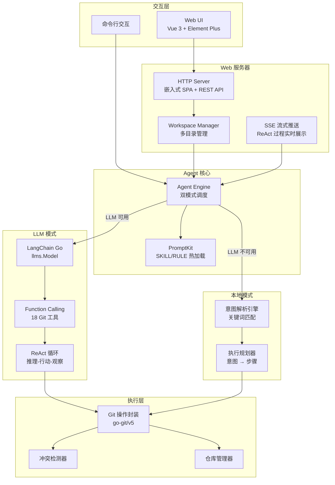
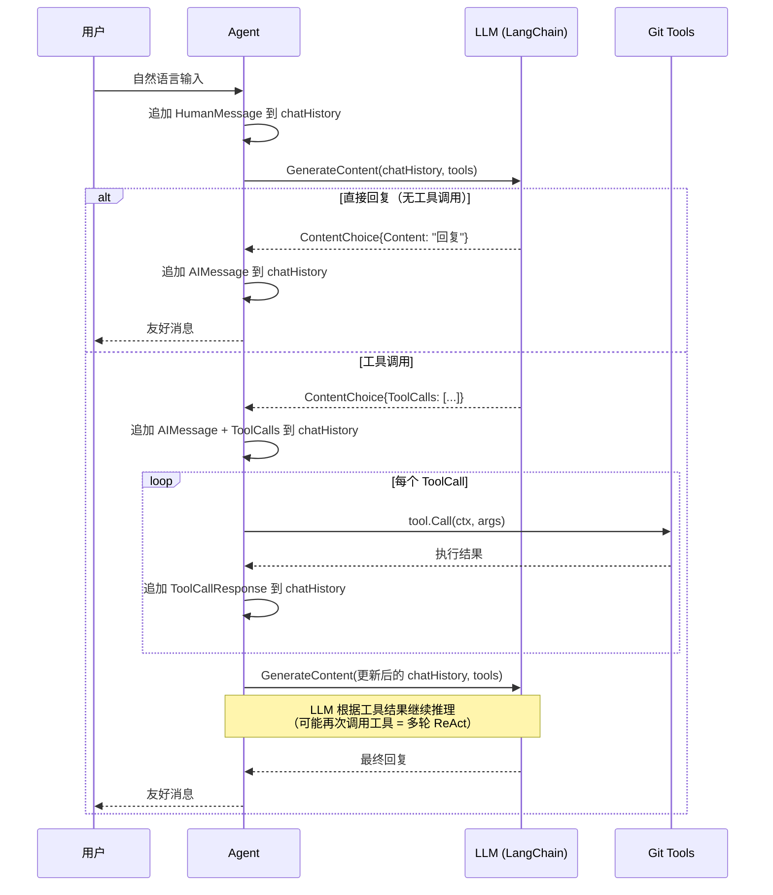
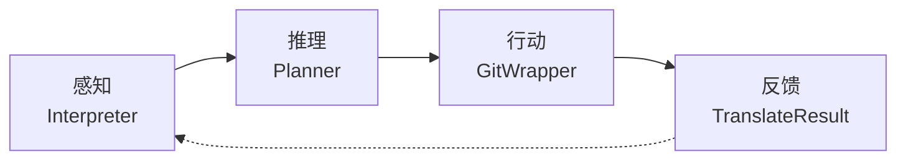
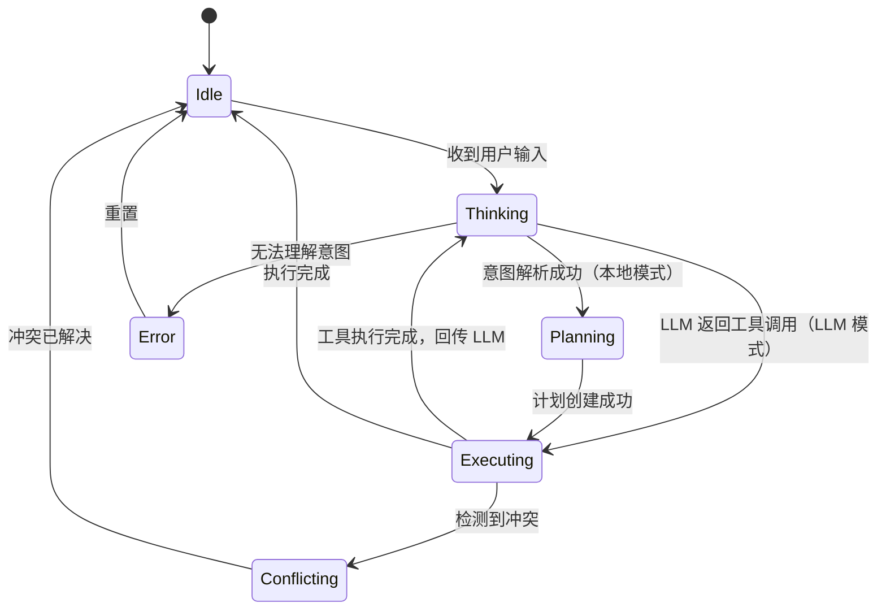

# Git Agent 🤖

[English](README.md) | 中文 | [📖 使用指南](docs/USAGE_zh.md) | [🔧 调校指南](docs/TUNING.md) | [🌐 Web 模式](docs/web-mode.md)

> 让完全不懂 git 的普通用户，也能像使用办公软件一样管理文件版本。

## 项目概述

Git Agent 是一个用 Go 语言实现的 **自然语言驱动的文件版本管理助手**。它的核心目标是让行业研究员、行政人员、市场人员等非技术用户，无需了解 `commit`、`branch`、`merge` 等 git 概念，只需用自然语言描述需求，Agent 就会自动完成对应的版本控制操作。

项目支持 **双模式运行**：

- 🧠 **LLM 模式**：基于 [LangChain Go](https://github.com/tmc/langchaingo) 框架，通过大语言模型理解用户意图，使用 Function Calling + ReAct 循环智能执行 Git 操作
- 📝 **本地模式（fallback）**：基于关键词匹配 + 硬编码规划，无需 API Key 即可使用

以及 **双界面访问**：

- 💻 **CLI 模式**：交互式命令行界面，适合终端用户
- 🌐 **Web 模式**：现代化浏览器界面，包含文件树、状态面板、历史记录、分支管理和 AI 对话助手 —— 适合偏好图形化操作的用户

## 设计哲学

1. **零 Git 知识门槛** — 用户完全不需要了解任何 git 命令
2. **自然语言交互** — 用户说需求，Agent 自动转换为 git 操作
3. **场景化操作** — 基于办公场景（研究报告、方案文档、数据文件）设计交互
4. **智能冲突处理** — 自动检测并协助解决多人编辑冲突
5. **优雅降级** — LLM 不可用时自动回退到本地模式
6. **智能认证策略** — 新仓库默认 HTTPS + 令牌（对新手友好）；已有仓库保持用户已配置的认证方式；SSH 认证自动读取 `~/.ssh/config` 中的 IdentityFile
7. **提交信息规范** — 自动生成英文 conventional commit 风格的提交信息（feat:/fix:/docs:/refactor:/chore:）
8. **SKILL/RULE 热加载** — 通过 Markdown 文件进行提示词工程，按意图加载，支持实时热更新

## 架构设计

### 整体架构


```mermaid
graph TB
    subgraph interaction[交互层]
        CLI[命令行交互]
        WebUI[Web UI<br/>Vue 3 + Element Plus]
    end

    subgraph web_server[Web 服务器]
        HTTP[HTTP Server<br/>嵌入式 SPA + REST API]
        SSE[SSE 流式推送<br/>ReAct 过程实时展示]
        WS_MGR[Workspace Manager<br/>多目录管理]
    end

    subgraph core[Agent 核心]
        AgentCore[Agent Engine<br/>双模式调度]
        PromptKit[PromptKit<br/>SKILL/RULE 热加载]
    end

    subgraph llm_mode[LLM 模式]
        LC[LangChain Go<br/>llms.Model]
        FC[Function Calling<br/>18 Git 工具]
        ReAct[ReAct 循环<br/>推理-行动-观察]
    end

    subgraph local_mode[本地模式]
        Interpreter[意图解析引擎<br/>关键词匹配]
        Planner[执行规划器<br/>意图 → 步骤]
    end

    subgraph execution[执行层]
        GitWrapper[Git 操作封装<br/>go-git/v5]
        ConflictDetector[冲突检测器]
        RepoManager[仓库管理器]
    end

    CLI --> AgentCore
    WebUI --> HTTP
    HTTP --> WS_MGR
    WS_MGR --> AgentCore
    SSE --> AgentCore
    AgentCore --> PromptKit
    AgentCore -->|LLM 可用| LC
    LC --> FC
    FC --> ReAct
    AgentCore -->|LLM 不可用| Interpreter
    Interpreter --> Planner
    ReAct --> GitWrapper
    Planner --> GitWrapper
    GitWrapper --> ConflictDetector
    GitWrapper --> RepoManager
```

### LLM 模式：ReAct 循环

LLM 模式采用 **ReAct（Reasoning + Acting）** 范式，LLM 在每轮对话中可以自主决定是直接回复还是调用工具，支持多轮工具调用：


```mermaid
sequenceDiagram
    participant U as 用户
    participant A as Agent
    participant L as LLM (LangChain)
    participant T as Git Tools

    U->>A: 自然语言输入
    A->>A: 追加 HumanMessage 到 chatHistory
    A->>L: GenerateContent(chatHistory, tools)
    alt 直接回复（无工具调用）
        L-->>A: ContentChoice{Content: "回复"}
        A->>A: 追加 AIMessage 到 chatHistory
        A-->>U: 友好消息
    else 工具调用
        L-->>A: ContentChoice{ToolCalls: [...]}
        A->>A: 追加 AIMessage + ToolCalls 到 chatHistory
        loop 每个 ToolCall
            A->>T: tool.Call(ctx, args)
            T-->>A: 执行结果
            A->>A: 追加 ToolCallResponse 到 chatHistory
        end
        A->>L: GenerateContent(更新后的 chatHistory, tools)
        Note over A,L: LLM 根据工具结果继续推理<br/>（可能再次调用工具 = 多轮 ReAct）
        L-->>A: 最终回复
        A-->>U: 友好消息
    end
```

### 本地模式：感知-推理-行动-反馈


```mermaid
graph LR
    A[感知<br/>Interpreter] --> B[推理<br/>Planner]
    B --> C[行动<br/>GitWrapper]
    C --> D[反馈<br/>TranslateResult]
    D -.-> A
```

| 阶段 | 模块 | 职责 |
|------|------|------|
| **感知** | Interpreter | 解析自然语言，识别用户意图 |
| **推理** | Planner | 将意图转化为多步骤执行计划 |
| **行动** | GitWrapper | 执行计划中的 git 操作 |
| **反馈** | Interpreter | 将执行结果翻译为用户友好的消息 |

### Agent 状态机


```mermaid
stateDiagram-v2
    [*] --> Idle
    Idle --> Thinking: 收到用户输入
    Thinking --> Planning: 意图解析成功（本地模式）
    Thinking --> Executing: LLM 返回工具调用（LLM 模式）
    Thinking --> Error: 无法理解意图
    Planning --> Executing: 计划创建成功
    Executing --> Conflicting: 检测到冲突
    Executing --> Thinking: 工具执行完成，回传 LLM
    Executing --> Idle: 执行完成
    Conflicting --> Idle: 冲突已解决
    Error --> Idle: 重置
```

## Web UI

Web UI 提供了现代化的图形界面来管理文件版本：

- **首页**：通过系统文件选择器或最近打开记录来打开本地目录
- **工作区视图**：文件树（左侧）、功能面板（右侧 — 状态/历史/分支）、AI 对话助手（右侧抽屉）
- **设置页**：配置用户信息、LLM API、HTTP 认证凭据
- **多工作区**：同时打开和切换多个目录

### 主要功能

| 功能 | 说明 |
|------|------|
| **文件树** | 浏览工作区文件，支持语法高亮预览 |
| **状态面板** | 查看修改/新增/删除的文件，多选提交，一键保存 |
| **历史面板** | 按作者/关键字筛选提交，查看 diff，回滚 |
| **分支面板** | 切换/创建分支，推送到远程 |
| **AI 对话** | 右侧抽屉面板，可折叠的 ReAct 推理步骤，快捷操作，流式响应 |
| **设置** | 持久化配置 `~/.git-agent/config.json`，LLM 连接测试 |
| **审计日志** | 破坏性操作记录到 `~/.git-agent/logs/ops.log` |

详细 Web 模式文档请参阅 [docs/web-mode.md](docs/web-mode.md)。

## SKILL/RULE 系统

提示词工程系统使用 **Markdown 文件**，按意图加载，支持热更新：

```
internal/promptkit/resources/     ← 内置（embed）
├── skills/                       ← 操作知识（按意图加载）
│   ├── batch-commit.md
│   ├── conflict-resolution.md
│   └── push-fail-guide.md
└── rules/                        ← 行为约束
    ├── always-execute.md
    ├── commit-message.md
    ├── display-format.md
    ├── no-git-terms.md
    ├── no-repeat-tools.md
    └── version-restore.md

~/.config/git-agent/              ← 用户级覆盖
.git-agent/                       ← 项目级覆盖（团队共享）
```

**覆盖优先级**：内置 < 用户级 < 项目级

调校和自定义详情请参阅 [docs/TUNING.md](docs/TUNING.md)。

## 代码结构

```
git-agent/
├── main.go                          # 主程序入口（CLI 交互模式、子命令分发）
├── serve.go                         # Web serve 子命令（配置合并、信号处理）
├── .air.toml                        # Air 热加载配置（仅开发模式）
├── Makefile                         # 构建自动化（前端+后端、开发模式、版本注入）
├── internal/
│   ├── version.go                   # 版本信息与 ASCII Logo（通过 ldflags 注入）
│   ├── agent/
│   │   ├── agent.go                 # Agent 核心引擎（双模式调度、ReAct 循环、状态管理）
│   │   └── events.go               # SSE 事件类型（Web 流式推送）
│   ├── llm/
│   │   ├── langchain.go            # LangChain LLM 工厂（openai.New 适配）
│   │   ├── git_tools.go            # 工具注册中心 + GitTool 适配器
│   │   ├── tools.go                # 18 个 GitAgentTool 定义（含 JSON Schema 参数）
│   │   └── provider.go             # 兼容保留（Usage、OpenAIConfig 等类型定义）
│   ├── promptkit/
│   │   ├── promptkit.go            # SKILL/RULE 加载器（embed + 文件系统，fsnotify 热加载）
│   │   ├── embed.go                # 嵌入资源 FS
│   │   └── resources/              # 内置 Skills & Rules（Markdown）
│   ├── interpreter/interpreter.go  # 自然语言意图解析（18 种意图、评分、否定上下文）
│   ├── planner/planner.go          # 执行规划器（意图 → 多步骤计划）
│   ├── gitwrapper/gitwrapper.go    # Git 操作封装（面向办公场景的高层接口）
│   ├── conflict/conflict.go        # 冲突检测与解决
│   ├── repository/repository.go    # 仓库管理（创建、克隆、列表）
│   └── web/
│       ├── server.go               # HTTP 服务器生命周期（监听、优雅关停）
│       ├── routes.go               # API 路由注册
│       ├── workspace.go            # Workspace 管理器（多目录、Agent 生命周期）
│       ├── handlers_agent_stream.go # SSE 流式推送（ReAct 过程）
│       ├── handlers_readonly.go    # 只读 API（状态、历史、diff、分支、文件内容）
│       ├── handlers_write.go       # 写入 API（提交、推送、拉取、分支、标签、初始化）
│       ├── handlers_settings.go    # 设置 API（配置 CRUD、LLM 测试）
│       ├── handlers_browse.go      # 文件系统浏览 API
│       ├── config.go               # 持久化配置存储（~/.git-agent/config.json）
│       ├── recent.go               # 最近打开目录存储
│       ├── audit.go                # 破坏性操作审计日志
│       ├── embed.go                # 前端产物嵌入
│       ├── pathcheck.go            # 路径穿越防护
│       └── safepath.go             # 系统目录黑名单
├── web/                             # 前端（Vue 3 + TypeScript + Element Plus）
│   ├── src/
│   │   ├── App.vue                 # 根组件（CSS 变量定义）
│   │   ├── main.ts                 # Vue 应用启动
│   │   ├── router.ts              # Vue Router（首页/工作区/设置）
│   │   ├── api/                   # API 客户端（fetch + SSE 流式）
│   │   ├── stores/                # Pinia 状态管理（workspaces、agentChat）
│   │   ├── views/                 # 页面视图（首页、工作区、设置）
│   │   └── components/workspace/  # 工作区组件（文件树、状态面板等）
│   ├── vite.config.ts             # Vite 配置（代理 /api → :8088）
│   └── package.json               # 前端依赖
├── docs/
│   ├── USAGE.md                   # 使用指南（英文）
│   ├── USAGE_zh.md                # 使用指南（中文）
│   ├── TUNING.md                  # 开发者调校指南
│   ├── web-mode.md                # Web 模式指南
│   └── agent-dev-walkthrough.md   # Agent 开发详解
├── go.mod
└── go.sum
```

## 快速开始

### 前置条件

- **Go 1.24+** — [下载](https://go.dev/dl/)
- **Node.js 18+** — [下载](https://nodejs.org/)（仅构建前端时需要）

### 安装

```bash
git clone <repo-url> git-agent
cd git-agent
go mod tidy
```

### 方式一：Web 模式（推荐）

```bash
# 构建前端 + 后端，然后启动 Web 服务
make build
./git-agent serve

# 或指定端口
./git-agent serve --port 9000
```

浏览器打开 `http://127.0.0.1:8088`，界面会引导您打开目录并管理版本。

### 方式二：CLI 模式

**本地模式**（无需 API Key）：
```bash
make dev
# 或：go run main.go
```

**LLM 模式**（需要 API Key）：
```bash
# OpenAI
go run main.go --api-key sk-xxx --model gpt-4o

# DeepSeek（国产，更便宜）
go run main.go --api-key sk-xxx --base-url https://api.deepseek.com/v1 --model deepseek-chat

# Azure OpenAI
go run main.go --api-key YOUR_KEY --base-url https://YOUR.openai.azure.com/openai/deployments/YOUR_MODEL --model gpt-4o

# 本地 Ollama（免费，离线可用）
go run main.go --api-key ollama --base-url http://localhost:11434/v1 --model qwen2.5:7b
```

### 从源码构建

```bash
# 完整构建（前端 + Go，注入版本信息）
make build

# 查看版本
./git-agent --version
```

## 开发

### 开发模式（热加载）

项目支持开发期间**前后端同时热加载**：

```bash
# 安装 air 用于 Go 热加载（一次性）
go install github.com/air-verse/air@latest

# 方式 A：两个终端
make dev-server   # 终端 1：后端（.go 文件修改自动重启）
make dev-web      # 终端 2：前端（Vite HMR，.vue/.ts 修改实时生效）

# 方式 B：一个终端
make dev-all      # 同时启动前后端热加载
```

访问 `http://localhost:5173` 查看开发前端（自动代理 `/api` 到后端 `:8088`）。

### Makefile 命令

| 命令 | 说明 |
|------|------|
| `make build` | 编译项目（前端 + Go，注入版本信息） |
| `make build-web` | 只构建前端到 `internal/web/dist/` |
| `make build-go-only` | 只编译 Go 二进制（跳过前端） |
| `make serve` | 构建并启动 Web 服务 |
| `make run` | 编译并运行 CLI 模式 |
| `make dev` | 开发模式直接运行（不注入版本信息） |
| `make dev-web` | 启动前端热加载服务（端口 5173） |
| `make dev-server` | 启动后端开发服务（端口 8088，支持 air 热加载） |
| `make dev-all` | 同时启动前后端热加载 |
| `make version` | 查看版本信息 |
| `make test` | 运行测试 |
| `make test-cover` | 运行测试并生成覆盖率报告 |
| `make lint` | 代码检查 |
| `make tidy` | 整理依赖 |
| `make clean` | 清理编译产物 |
| `make install` | 安装到 GOPATH/bin |

### 命令行参数

| 参数 | 说明 | 环境变量 |
|------|------|----------|
| `--api-key` | LLM API Key | `GIT_AGENT_API_KEY` |
| `--base-url` | LLM API Base URL | `GIT_AGENT_BASE_URL` |
| `--model` | LLM 模型名称 | `GIT_AGENT_MODEL` |
| `--repo` | 仓库路径（默认 `.`） | — |
| `--version` | 显示版本信息 | — |
| `--help` | 显示帮助信息 | — |

### Serve 子命令参数

| 参数 | 说明 | 默认值 |
|------|------|--------|
| `--port` | Web 服务端口 | `8088` |
| `--host` | 监听地址 | `127.0.0.1` |
| `--open` | 自动打开浏览器 | `true` |
| `--i-know-what-i-do` | 允许局域网访问 | `false` |

### 环境变量

| 变量 | 说明 | 默认值 |
|------|------|--------|
| `GIT_AGENT_API_KEY` | LLM API Key | — |
| `GIT_AGENT_BASE_URL` | LLM API 地址 | `https://api.openai.com/v1` |
| `GIT_AGENT_MODEL` | LLM 模型名称 | `gpt-4o` |
| `GIT_AGENT_MAX_TOKENS` | 最大 token 数 | `4096` |
| `GIT_AGENT_USER` | 用户名（**必填**） | — |
| `GIT_AGENT_EMAIL` | 用户邮箱（**必填**） | — |
| `GIT_HTTP_USERNAME` | HTTPS Git 用户名（推送认证用） | — |
| `GIT_HTTP_PASSWORD` | HTTPS Git 密码/令牌（推送认证用） | — |

## 开发路线

### Phase 1 — 基础 MVP ✅
- [x] 单用户版本管理功能
- [x] 自然语言意图解析引擎（18 种意图）
- [x] 执行规划器
- [x] Git 操作封装（面向办公语言）
- [x] 冲突检测与解决
- [x] 仓库管理
- [x] 交互式命令行界面

### Phase 2 — LLM 智能增强 ✅
- [x] 集成 LangChain Go 框架（v0.1.14）
- [x] Function Calling + ReAct 循环（多轮迭代）
- [x] 18 个 Git 工具定义与注册中心
- [x] OpenAI / DeepSeek / Azure / Ollama 多模型支持
- [x] LLM 失败自动回退本地模式
- [x] 对话上下文管理
- [x] Commit message 质量保障（双层校验）
- [x] HTTPS 认证支持推送操作
- [x] SKILL/RULE 热加载提示词系统（PromptKit）

### Phase 3 — Web UI ✅
- [x] 嵌入式 Web 服务器（`go embed` + SPA）
- [x] 文件树浏览与语法高亮预览
- [x] 状态/历史/分支面板
- [x] AI 对话助手（流式 ReAct 可视化）
- [x] 多工作区支持
- [x] 设置页（用户信息、LLM 配置、HTTP 认证）
- [x] 持久化配置（`~/.git-agent/config.json`）
- [x] 破坏性操作审计日志
- [x] 前端热加载（Vite HMR）+ 后端热加载（air）

### Phase 4 — 团队协作 🚧
- [ ] 多用户提交与查看
- [ ] 权限管理（编辑者、查看者、管理员）

### Phase 5 — 高级功能 📋
- [ ] 智能冲突解决建议（基于 LLM 增强）
- [ ] Web UI 可视化差异对比
- [ ] 集成办公软件插件
- [ ] 云存储适配（对接 Google Drive、OneDrive 等）

## 技术栈

| 技术 | 用途 |
|------|------|
| **Go 1.24+** | 后端语言 |
| [go-git/v5](https://github.com/go-git/go-git) | Git 操作底层实现 |
| [LangChain Go v0.1.14](https://github.com/tmc/langchaingo) | LLM 框架（Function Calling、消息管理） |
| **Vue 3 + TypeScript** | 前端框架 |
| **Element Plus** | UI 组件库 |
| **Vite** | 前端构建工具（开发模式 HMR） |
| **Pinia** | 前端状态管理 |
| [air](https://github.com/air-verse/air) | Go 后端热加载（开发模式） |
| **Agent Loop** | 核心架构模式（感知 → 推理 → 行动 → 反馈） |
| **ReAct** | LLM 推理模式（Reasoning + Acting 循环） |

## 文档索引

| 文档 | 说明 |
|------|------|
| [README.md](README.md) | 项目概述（英文） |
| [README_zh.md](README_zh.md) | 项目概述（中文） |
| [docs/USAGE.md](docs/USAGE.md) | 使用指南（英文） |
| [docs/USAGE_zh.md](docs/USAGE_zh.md) | 使用指南（中文） |
| [docs/TUNING_en.md](docs/TUNING_en.md) | 开发者调校指南（英文） |
| [docs/TUNING.md](docs/TUNING.md) | 开发者调校指南（中文） |
| [docs/web-mode_en.md](docs/web-mode_en.md) | Web 模式指南（英文） |
| [docs/web-mode.md](docs/web-mode.md) | Web 模式指南（中文） |
| [docs/agent-dev-walkthrough.md](docs/agent-dev-walkthrough.md) | Agent 开发详解 |

---

**核心价值**：将强大的 Git 版本控制能力转化为普通办公人员可理解、可使用的日常工作工具，降低团队协作门槛，提升文档管理效率。
