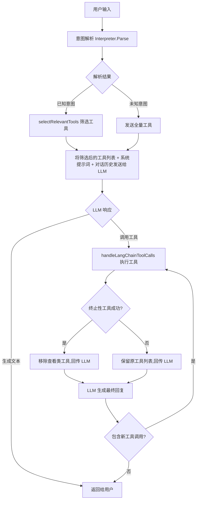
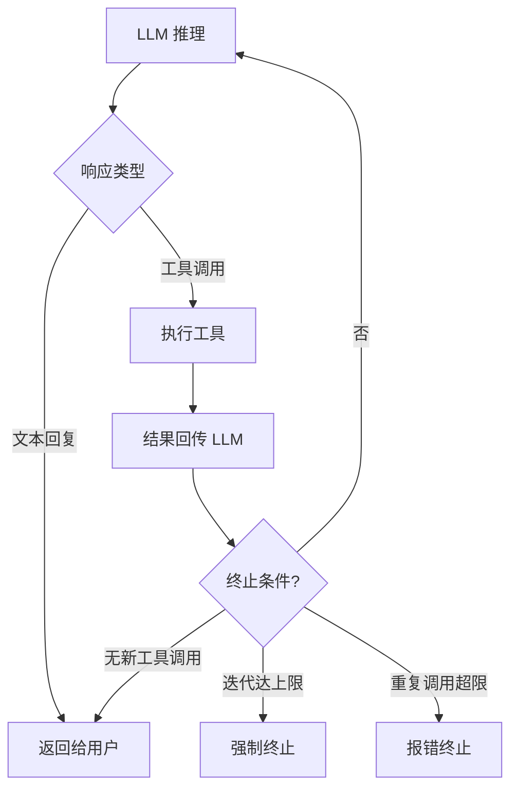
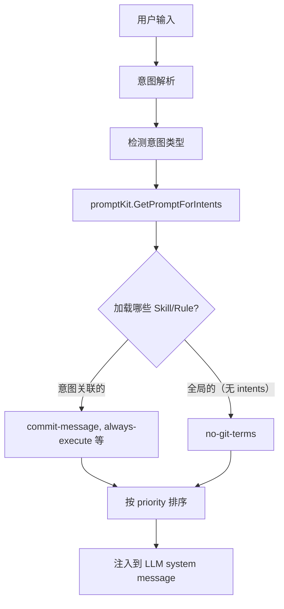

# 意图解析与 LLM 调校指南

本文档面向开发人员，介绍 git-agent 的意图解析机制、LLM 工具调用流程，以及常见问题的排查思路和调校方法。

---

## 目录

1. [架构概览](#1-架构概览)
2. [意图解析器（Interpreter）](#2-意图解析器interpreter)
3. [工具筛选与上下文感知](#3-工具筛选与上下文感知)
4. [ReAct 循环与终止性工具](#4-react-循环与终止性工具)
5. [SKILL/RULE 按需加载系统](#5-skillrule-按需加载系统)
6. [系统提示词调校](#6-系统提示词调校)
7. [常见问题排查](#7-常见问题排查)
8. [调校清单](#8-调校清单)

---

## 1. 架构概览

git-agent 的请求处理流程如下：



**核心设计思路**：通过本地意图解析器预判用户意图，只给 LLM 发送少量相关工具，降低小模型的 function calling 难度。

**涉及的关键文件**：

| 文件 | 职责 |
|------|------|
| `internal/interpreter/interpreter.go` | 意图解析：关键词匹配 + 评分 + 否定上下文处理 |
| `internal/promptkit/promptkit.go` | SKILL/RULE 按需加载器：动态组装提示词 |
| `internal/agent/agent.go` | 工具筛选、ReAct 循环、终止性工具检测、重复调用防护 |
| `internal/llm/prompts.go` | 系统提示词骨架：角色定义 |
| `internal/llm/tools.go` | 工具定义：工具名称、描述、参数 |

---

## 2. 意图解析器（Interpreter）

### 2.1 解析流程

意图解析器采用两级匹配策略：

1. **精确匹配**：用户输入完全等于某个关键词 → 直接返回，置信度 1.0
2. **模糊匹配**：`strings.Contains(input, keyword)` → 评分排名，选最高分

```
用户输入 → 精确匹配(输入 == 关键词) → 命中 → 返回(置信度 1.0)
                    ↓ 未命中
          模糊匹配(输入 contains 关键词) → 评分 → 消歧 → 返回
                    ↓ 无匹配
          返回 IntentUnknown
```

### 2.2 评分算法（matchScoreEx）

每个意图有一组关键词，遍历所有意图的关键词列表，计算匹配分数：

| 关键词长度（rune） | 基础分 |
|--------------------|--------|
| ≥ 4 字符 | 0.5 |
| 3 字符 | 0.4 |
| 2 字符 | 0.3 |
| 1 字符 | 0.2 |

**加分项**：输入 ≤ 6 个字符且命中 → +0.1（短输入匹配更精准）

**惩罚项**（否定上下文）：当输入包含"没提交/未提交/没保存/未保存"等否定词时，如果匹配到的是操作类关键词（"提交"、"保存"、"存"等），则每个命中扣 0.25 分。

**示例**：

| 用户输入 | 命中意图 | 命中关键词 | 计算过程 | 最终分数 |
|----------|----------|------------|----------|----------|
| "还有哪些修改没提交的" | save_version | "提交"(2字) | 0.3 - 0.25 = 0.05 | 0.05 |
| "还有哪些修改没提交的" | view_status | "哪些修改没提交"(7字) | 0.5 | **0.5** ✅ 胜出 |
| "提交" | save_version | "提交"(2字) | 0.3 + 0.1(短输入) | **0.4** ✅ |
| "提交记录" | view_history | "提交记录"(4字) | 0.5 | **0.5** ✅ |

### 2.3 消歧规则

当多个意图分数相同时，按以下规则消歧：

1. **分数高者优先**
2. **分数相同时，命中更长关键词者优先**（更具体的关键词更可靠）
3. **都相同时，patterns 数组中先定义者优先**

### 2.4 否定上下文机制

**背景**：用户说"还有哪些修改没提交的"是**查看意图**（想看未提交的文件列表），但"提交"这个词同时存在于 `save_version` 的关键词中，导致二义性。

**解决方案**：

1. 在 `view_status` 关键词中添加否定表达（如"没提交"、"未提交"、"哪些没提交"等）
2. 在 `matchScoreEx` 中检测否定上下文，对操作类关键词降分

```go
// 否定上下文检测
negativeContext := strings.Contains(input, "没提交") ||
    strings.Contains(input, "未提交") ||
    strings.Contains(input, "没有提交") ||
    strings.Contains(input, "没保存") ||
    strings.Contains(input, "未保存") ||
    strings.Contains(input, "不用提交") ||
    strings.Contains(input, "不要提交") ||
    strings.Contains(input, "不提交")

// 如果是否定上下文 + 操作类关键词，扣分
if negativeContext && (kwLower == "提交" || kwLower == "保存" || ...) {
    score -= 0.25
}
```

**调校要点**：如果发现新的否定表达导致误判，需要在两个地方同步修改：
1. `view_status`/`view_diff` 的关键词列表中添加该表达
2. `matchScoreEx` 的 `negativeContext` 检测中添加该表达

### 2.5 意图与关键词对照表

| 意图类型 | 核心关键词 | 说明 |
|----------|------------|------|
| `save_version` | 保存、提交、存一下、commit、save | 操作意图：保存当前修改 |
| `view_history` | 历史、记录、提交记录、log、history | 查看意图：查看提交历史 |
| `restore_version` | 恢复、回滚、还原、回退、撤销 | 操作意图：恢复到旧版本 |
| `view_diff` | 差异、diff、修改内容、改了什么、改动 | 查看意图：查看修改详情 |
| `view_status` | 状态、status、有没有改、没提交、未提交 | 查看意图：查看当前状态 |
| `submit_change` | 提交给团队、申请合并、pr | 操作意图：提交审核/PR |
| `push` | 推送、push | 操作意图：推送到远程 |
| `pull` | 拉取、pull | 操作意图：拉取最新 |

> ⚠️ **注意**：关键词的顺序不影响匹配结果，但关键词的**长度**影响评分——越长越具体的关键词得分越高。添加关键词时优先添加用户实际使用的完整表达（如"哪些修改没提交"），而非拆分为短词。

---

## 3. 工具筛选与上下文感知

### 3.1 意图到工具的映射

`intentToolMapping` 定义了每个意图对应的工具列表：

```go
var intentToolMapping = map[string][]string{
    "save_version":     {"save_version", "view_status", "view_diff", "update_user_info"},
    "view_history":     {"view_history", "view_status"},
    "view_diff":        {"view_diff", "view_status"},
    "view_status":      {"view_status", "view_diff", "view_history"},
    "submit_change":    {"submit_change", "view_diff", "view_status", "push_to_remote", "update_user_info"},
    // ... 其他意图
}
```

**设计原则**：
- 操作类意图（save_version、submit_change）包含查看类工具（view_diff），因为 LLM 需要先查看修改再操作
- 查看类意图（view_diff、view_status）不包含操作类工具，避免误操作
- `view_status` 始终作为辅助工具包含（除 `init_repo` 外）

### 3.2 上下文感知优化

`selectRelevantTools` 中的两项关键优化：

#### 优化1：已查看过的 diff 不再重复提供

```go
if a.hasToolResultInHistory("view_diff") {
    // 从工具列表中移除 view_diff 和 detect_conflict
}
```

**原理**：如果 chat history 中已有 `view_diff` 的结果，LLM 再次看到 `view_diff` 工具时会习惯性地再次调用它，而不是直接调用 `save_version`。移除后 LLM 只能选择操作类工具。

**适用场景**：用户先问了"修改了什么"（触发 view_diff），然后说"提交修改"时，LLM 不需要再次查看 diff，直接基于已有结果提交。

#### 优化2：操作类工具排在前面

```go
// 操作类工具排在前面，查看类工具排在后面
result := append(actionTools, viewTools...)
```

**原理**：LLM 在选择工具时倾向于选择列表中靠前的工具。将 `save_version` 排在 `view_diff` 前面，可以提高 LLM 直接调用操作类工具的概率。

### 3.3 调校要点

- **工具太多导致小模型不调用任何工具**：检查 `intentToolMapping` 中该意图对应的工具数量，建议不超过 5 个
- **LLM 总是先查看再操作**：检查工具列表中 `view_diff` 是否排在 `save_version` 前面
- **LLM 重复查看 diff**：检查 `hasToolResultInHistory` 是否正确检测到历史结果
- **新增意图时**：必须在 `intentToolMapping` 中添加对应的工具映射，否则会回退到全量工具

---

## 4. ReAct 循环与终止性工具

### 4.1 ReAct 循环机制

git-agent 使用 ReAct（Reasoning + Acting）模式：LLM 决定调用什么工具 → 执行工具 → 结果回传 LLM → LLM 决定下一步。

**最大迭代次数**：`maxReActIterations = 5`



### 4.2 终止性工具机制

**问题**：LLM 在 `save_version` 成功后，习惯性地调用 `view_diff` 来"确认保存是否成功"，导致无意义的重复查看。

**解决方案**：定义"终止性工具"，成功执行后从后续工具列表中移除查看类工具。

**终止性工具列表**：
- `save_version`：保存版本
- `submit_change`：提交更改给团队
- `push_to_remote`：推送到远程
- `restore_version`：恢复版本

**处理逻辑**：

```go
if terminalToolCalled {
    // 过滤掉查看类工具，只保留操作类工具
    for _, tool := range a.currentTools {
        if !strings.HasPrefix(name, "view_") && name != "detect_conflict" {
            filteredTools = append(filteredTools, tool)
        }
    }
    // 如果过滤后没有工具了，设为 nil 让 LLM 生成纯文本
}
```

**为什么不是直接清空所有工具？** 因为存在分批提交场景——用户说"先提交代码再提交文档"时，LLM 需要在第一次 `save_version` 后仍能调用第二次 `save_version`。

### 4.3 重复调用防护

| 工具类型 | 最大调用次数 | 超限行为 |
|----------|--------------|----------|
| 查看类（`view_*`、`detect_conflict`） | 2 次 | 返回错误，提示操作可能已完成 |
| 操作类（`save_version` 等） | 3 次 | 返回错误，提示操作可能已完成 |

**附加机制**：当查看类工具被调用 ≥ 2 次时，在返回结果中附加终止信号：

```
[SYSTEM NOTICE: You have already called view_diff 2 times. 
Do NOT call this tool again. Use the information above to 
generate your final response to the user NOW.]
```

### 4.4 三层防护总览

| 层级 | 机制 | 作用 | 硬/软约束 |
|------|------|------|-----------|
| 第1层 | 终止性工具成功后移除查看类工具 | 从根源上阻止 LLM 反复查看 | 硬约束 |
| 第2层 | 重复调用检测（2次/3次） | 代码层兜底防护 | 硬约束 |
| 第3层 | 系统提示词 + 工具返回值终止信号 | 引导 LLM 行为 | 软约束 |

---

## 5. SKILL/RULE 按需加载系统

### 5.1 设计背景

之前的调校方式是将所有规则硬编码在 `prompts.go` 和 `tools.go` 中。这导致：

1. **修改规则需要改源码**：每次调整都要改代码、重新编译
2. **所有规则全量注入**：LLM 每次都收到所有规则，小模型"注意力超载"
3. **不同模型需求不同**：GPT-4o 能处理复杂规则，7B 小模型需要精简规则
4. **规则之间冲突**："必须先 view_diff" 和 "直接执行不要犹豫" 在小模型上互相矛盾

### 5.2 架构设计

```
┌─────────────────────────────────────────────────────┐
│  internal/promptkit/resources/  ← 内置（embed）      │
│  ├── skills/                                        │
│  │   ├── commit-message.md    ← Commit message 规范 │
│  │   ├── batch-commit.md      ← 分批提交指引        │
│  │   ├── push-fail-guide.md   ← 推送失败提示规则    │
│  │   ├── conflict-resolution.md ← 冲突处理指引      │
│  │   ├── display-format.md    ← 输出格式规范        │
│  │   └── version-restore.md   ← 版本恢复指引        │
│  └── rules/                                         │
│      ├── always-execute.md    ← 直接执行规则        │
│      ├── no-repeat-tools.md   ← 不重复调用规则      │
│      └── no-git-terms.md      ← 术语翻译规则        │
│                                                     │
│  ~/.config/git-agent/         ← 用户自定义（覆盖内置）│
│  ├── skills/                                        │
│  └── rules/                                         │
│                                                     │
│  .git-agent/                  ← 项目级（覆盖用户级） │
│  ├── skills/                                        │
│  └── rules/                                         │
└─────────────────────────────────────────────────────┘
```

**覆盖优先级**：内置 < 用户级 < 项目级

### 5.3 Skill vs Rule

| 类型 | 定义 | 特点 | 示例 |
|------|------|------|------|
| **Skill** | 具体的操作知识 | 关联特定意图，按需加载 | Commit message 撰写规范、冲突处理步骤 |
| **Rule** | 行为约束/禁止 | 可关联意图或全局生效 | 直接执行不犹豫、不使用 git 术语 |

### 5.4 Markdown 文件格式

每个 Skill/Rule 是一个 Markdown 文件，第一行可选 meta 注释：

```markdown
<!-- meta: {"intents":["save_version","submit_change"],"priority":10,"description":"Commit message 规范"} -->

# Commit Message 撰写规范

具体的规则内容...
```

**meta 字段说明**：

| 字段 | 类型 | 说明 |
|------|------|------|
| `intents` | string[] | 关联的意图列表，当意图命中时加载此 Skill/Rule |
| `priority` | int | 排序优先级，数字越小越靠前（默认50） |
| `description` | string | 简短描述 |

如果 meta 行缺失，系统会根据文件名推断 `intents` 和 `description`。

### 5.5 按需加载机制



**加载策略**：
- 意图关联的 Skill/Rule：只在对应意图被触发时加载
- 全局 Rule（`intents` 为空）：始终加载
- Priority 排序：Rule 一般 priority 较小（1-10），确保行为约束在 Skill 之前

### 5.6 如何新增 Skill/Rule

#### 方式1：添加内置 Skill/Rule（需改源码）

1. 在 `internal/promptkit/resources/skills/` 或 `rules/` 下创建 `.md` 文件
2. 添加 meta 行指定 intents 和 priority
3. 重新编译

**示例**：添加一个"模型专用规则"——在 `rules/` 下创建 `small-model-hints.md`：

```markdown
<!-- meta: {"intents":["save_version","submit_change"],"priority":3,"description":"小模型精简规则"} -->

# 小模型操作提示
- 用户说"提交"时，直接调用 save_version 工具，一步到位
- 不要先查看再操作，直接执行
```

#### 方式2：用户自定义 Skill/Rule（无需改源码）

1. 在 `~/.config/git-agent/skills/` 或 `rules/` 下创建同名 `.md` 文件
2. 文件名与内置文件名相同则覆盖，不同则新增
3. **保存即生效**，无需重启（fsnotify 热加载，300ms 防抖）

**示例**：覆盖内置的 commit-message 规则——创建 `~/.config/git-agent/skills/commit-message.md`

#### 方式3：项目级 Skill/Rule（团队共享）

1. 在仓库根目录下创建 `.git-agent/skills/` 或 `rules/` 目录
2. 添加 `.md` 文件
3. 可以提交到仓库，团队共享
4. 同样支持热加载，保存即生效

### 5.7 禁用 Skill/Rule

在配置中添加禁用列表：

```go
// 创建 Kit 时传入禁用列表
kit := promptkit.NewKit(promptkit.ResourcesFS, promptkit.Config{
    Disabled: []string{"display-format"}, // 禁用 display-format skill
})
```

### 5.8 当前内置的 Skill/Rule 清单

#### Skills（操作知识）

| 名称 | 关联意图 | Priority | 说明 |
|------|----------|----------|------|
| `commit-message` | save_version, submit_change | 10 | Commit message 撰写规范 |
| `batch-commit` | save_version, submit_change | 20 | 分批提交操作指引 |
| `conflict-resolution` | detect_conflict, approve_merge | 20 | 冲突处理指引 |
| `version-restore` | restore_version | 20 | 版本恢复操作指引 |
| `push-fail-guide` | submit_change, push | 30 | 推送失败的友好提示规则 |
| `display-format` | view_history, view_status | 30 | 输出格式规范 |

#### Rules（行为约束）

| 名称 | 关联意图 | Priority | 说明 |
|------|----------|----------|------|
| `no-git-terms` | （全局） | 1 | 不向用户暴露 git 术语 |
| `always-execute` | save_version, submit_change 等 | 5 | 直接执行操作，不要只给建议 |
| `no-repeat-tools` | save_version, submit_change 等 | 6 | 避免重复调用工具 |

---

## 6. 系统提示词调校

### 6.1 关键规则

系统提示词中与工具调用行为直接相关的规则：

| 规则 | 位置 | 作用 |
|------|------|------|
| **直接执行，不要只给建议** | 操作指引 | 防止 LLM 输出文本建议而不调用工具 |
| **避免重复调用工具** | 操作指引 | 防止 LLM 反复调用同一查看类工具 |
| **保存版本时的操作规范** | 操作指引 | view_diff 后立即调用 save_version，不要插入文字 |
| **分批提交时避免循环** | 操作指引 | 每次提交只 view_diff + save_version 一次 |

### 6.2 工具描述调校

工具描述（`tools.go`）是 LLM 选择工具的主要依据。关键调校点：

- **`save_version` 描述**：明确"如果对话历史中已有 view_diff 的结果，直接基于该结果调用本工具"——防止 LLM 在已有 diff 结果时仍去重新查看
- **`submit_change` 描述**：同上，并强调"不要在 view_diff 和 submit_change 之间插入文字说明或建议"
- 工具描述中的"**重要规则**"标记会引起 LLM 注意，比普通文本更有效

### 6.3 调校原则

1. **具体而非笼统**：❌ "不要重复调用" → ✅ "如果对话历史中已有 view_diff 的结果，直接基于该结果调用本工具"
2. **正面指令优于负面禁令**：❌ "不要在中间插入文字" → ✅ "应连续完成操作"（但负面禁令也有效，可以并用）
3. **规则放在工具描述中**：工具描述比系统提示词更容易被 LLM 遵守，因为 LLM 在选择工具时会仔细阅读工具描述
4. **大写强调**：`**重要规则**`、`[SYSTEM NOTICE]` 等大写标记对小模型有额外约束力

---

## 7. 常见问题排查

### 问题1：意图解析错误（"还有哪些修改没提交的"被识别为 save_version）

**症状**：用户想查看未提交的修改，但 LLM 执行了保存操作或返回了已提交的历史记录。

**排查步骤**：

1. 添加测试用例验证意图：
   ```go
   func TestYourInput(t *testing.T) {
       p := New("zh")
       intent, err := p.Parse("还有哪些修改没提交的")
       fmt.Printf("意图: %s, 置信度: %.2f\n", intent.Type, intent.Confidence)
   }
   ```

2. 手动计算 `matchScoreEx` 得分：
   - 列出输入中包含的所有关键词
   - 对每个意图计算分数（注意否定上下文惩罚）
   - 比较分数，确认消歧结果

3. 修复方法：
   - 在正确意图的关键词列表中添加该表达
   - 如果存在否定上下文问题，在 `matchScoreEx` 中添加否定词检测

### 问题2：LLM 只给建议不调用工具

**症状**：用户说"提交修改"，LLM 输出了 commit message 建议但没有调用 `save_version`。

**排查步骤**：

1. 检查 `selectRelevantTools` 是否正确筛选出了 `save_version` 工具
2. 检查 `save_version` 是否在工具列表中排在前面（操作类工具应排在查看类前面）
3. 检查 chat history 中是否已有 `view_diff` 结果——如果有但工具列表中仍包含 `view_diff`，LLM 可能选择再次查看而非直接操作

4. 修复方法：
   - 在系统提示词中强化"直接执行"规则
   - 在工具描述中添加"直接调用"指引
   - 确认 `hasToolResultInHistory` 正确移除了重复的查看类工具

### 问题3：LLM 反复调用 view_diff

**症状**：LLM 在 `save_version` 后又调用 `view_diff` 来"确认"，形成循环。

**排查步骤**：

1. 检查终止性工具逻辑是否生效——`terminalToolCalled` 是否为 true
2. 检查 `toolsForLLM` 是否正确过滤了查看类工具
3. 检查 `callHistory` 是否正确累计——注意每次新的用户输入会重置 callHistory

4. 修复方法：
   - 确认 `terminalTools` 列表中包含 `save_version`
   - 确认过滤逻辑正确移除了 `view_*` 前缀的工具
   - 如果 LLM 仍反复调用，降低 `maxCallsForTool` 阈值

### 问题4：用户确认后 LLM 不执行

**症状**：LLM 先给出了 commit message 建议，用户说"用这个提交"，LLM 没有调用 `save_version`。

**排查步骤**：

1. 确认意图解析器能识别确认性语句（"用这个提交"、"按照XX提交"等）
2. 确认 `hasToolResultInHistory("view_diff")` 返回 true（上一轮已查看过 diff）
3. 确认 `selectRelevantTools` 在已有 diff 结果时移除了 `view_diff`

4. 修复方法：
   - 在 `save_version` 工具描述中强调"如果对话历史中已有 view_diff 结果，直接调用本工具"
   - 确保操作类工具排在查看类前面

### 问题5：意图解析后的工具列表不正确

**症状**：意图解析正确，但 LLM 拿到的工具列表中缺少或多余某些工具。

**排查步骤**：

1. 检查 `intentToolMapping` 中该意图的工具映射是否正确
2. 检查 `hasToolResultInHistory` 是否误判导致移除了必要工具
3. 检查 `view_status` 是否被正确添加（默认应包含）

4. 修复方法：
   - 修改 `intentToolMapping` 中对应意图的工具列表
   - 注意：新增意图类型时必须在 `intentToolMapping` 中添加映射

---

## 8. 调校清单

当遇到 LLM 行为异常时，按以下清单逐项排查：

### 意图解析层
- [ ] 用户输入是否被正确解析为目标意图？写测试用例验证
- [ ] 是否存在否定上下文误判？（"没提交"被识别为"提交"）
- [ ] 同分消歧时，patterns 数组顺序是否合理？
- [ ] 关键词是否覆盖了用户的常见表达？

### 工具筛选层
- [ ] `intentToolMapping` 中该意图的工具列表是否正确？
- [ ] `hasToolResultInHistory` 是否正确检测到历史工具结果？
- [ ] 操作类工具是否排在查看类前面？
- [ ] 工具数量是否 ≤ 5 个？（小模型建议 ≤ 4 个）

### ReAct 循环层
- [ ] 终止性工具列表是否包含所有"一次性操作"？
- [ ] 终止性工具成功后，查看类工具是否被正确移除？
- [ ] `callHistory` 的重复调用阈值是否合理？
- [ ] 最大迭代次数（5）是否需要调整？

### 提示词层
- [ ] 系统提示词中是否有"直接执行"的规则？
- [ ] 工具描述中是否包含"已有结果时直接使用"的指引？
- [ ] 工具描述是否过于复杂导致小模型理解困难？
- [ ] 关键规则是否使用了强调标记（加粗、大写等）？

### SKILL/RULE 层
- [ ] 意图对应的 Skill/Rule 是否正确加载？（查看 `promptKit.ListAll()`）
- [ ] 用户自定义的 Skill/Rule 是否正确覆盖了内置版本？
- [ ] Skill 的 priority 排序是否合理？（Rule 应在 Skill 之前）
- [ ] 是否需要为特定模型禁用某些 Skill？（如小模型禁用 display-format）
- [ ] 全局 Rule（如 no-git-terms）是否始终生效？
- [ ] 新增意图时，是否在 Skill/Rule 的 meta.intents 中添加了对应意图？
- [ ] 编辑 .md 文件后是否热加载生效？（查看日志中 `[promptkit] Skills/Rules 热重载完成`）
- [ ] fsnotify 监听是否正常启动？（查看日志中 `[promptkit] 监听目录`）

### 模型能力层
- [ ] 当前模型是否支持 function calling？（某些本地模型不支持）
- [ ] 模型参数量是否足够？（7B 模型在 5+ 工具时表现下降明显）
- [ ] `tool_choice: "auto"` 是否被正确传递？
- [ ] 是否需要考虑 `tool_choice: "required"` 强制调用工具？
