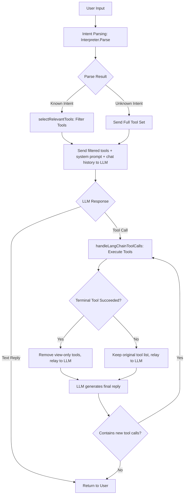
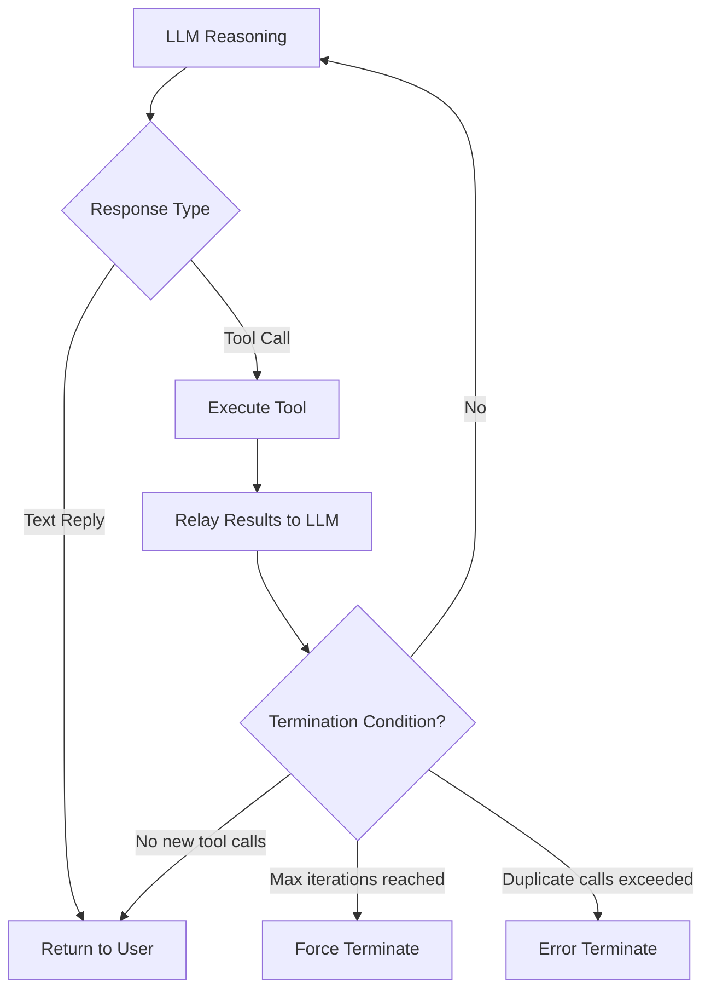

# Intent Parsing & LLM Tuning Guide

This document is intended for developers. It covers git-agent's intent parsing mechanism, LLM tool-calling workflow, common troubleshooting approaches, and tuning methods.

---

## Table of Contents

1. [Architecture Overview](#1-architecture-overview)
2. [Intent Parser (Interpreter)](#2-intent-parser-interpreter)
3. [Tool Selection & Context Awareness](#3-tool-selection--context-awareness)
4. [ReAct Loop & Terminal Tools](#4-react-loop--terminal-tools)
5. [SKILL/RULE On-Demand Loading System](#5-skillrule-on-demand-loading-system)
6. [System Prompt Tuning](#6-system-prompt-tuning)
7. [Common Issue Troubleshooting](#7-common-issue-troubleshooting)
8. [Tuning Checklist](#8-tuning-checklist)

---

## 1. Architecture Overview

The request processing flow of git-agent is as follows:



**Core Design Principle**: The local intent parser pre-determines user intent and sends only a small set of relevant tools to the LLM, reducing the function-calling difficulty for smaller models.

**Key Files**:

| File | Responsibility |
|------|----------------|
| `internal/interpreter/interpreter.go` | Intent parsing: keyword matching + scoring + negation context handling |
| `internal/promptkit/promptkit.go` | SKILL/RULE on-demand loader: dynamic prompt assembly |
| `internal/agent/agent.go` | Tool selection, ReAct loop, terminal tool detection, duplicate call prevention |
| `internal/llm/prompts.go` | System prompt skeleton: role definition |
| `internal/llm/tools.go` | Tool definitions: tool names, descriptions, parameters |

---

## 2. Intent Parser (Interpreter)

### 2.1 Parsing Flow

The intent parser uses a two-level matching strategy:

1. **Exact Match**: User input exactly equals a keyword → return immediately, confidence 1.0
2. **Fuzzy Match**: `strings.Contains(input, keyword)` → score and rank, select highest score

```
User Input → Exact Match (input == keyword) → Hit → Return (confidence 1.0)
                    ↓ Miss
          Fuzzy Match (input contains keyword) → Score → Disambiguate → Return
                    ↓ No match
          Return IntentUnknown
```

### 2.2 Scoring Algorithm (matchScoreEx)

Each intent has a set of keywords. The algorithm iterates over all intents' keyword lists and calculates match scores:

| Keyword Length (rune) | Base Score |
|-----------------------|------------|
| ≥ 4 characters | 0.5 |
| 3 characters | 0.4 |
| 2 characters | 0.3 |
| 1 character | 0.2 |

**Bonus**: Input ≤ 6 characters and matched → +0.1 (short inputs are more precise matches)

**Penalty** (negation context): When the input contains negation phrases like "haven't committed / not saved / unsaved", if the matched keyword is an action keyword ("commit", "save", etc.), each hit is penalized by -0.25.

**Examples**:

| User Input | Matched Intent | Matched Keyword | Calculation | Final Score |
|------------|----------------|-----------------|-------------|-------------|
| "which changes haven't been committed" | save_version | "commit" (2 chars) | 0.3 - 0.25 = 0.05 | 0.05 |
| "which changes haven't been committed" | view_status | "which changes haven't committed" (7+ chars) | 0.5 | **0.5** ✅ Winner |
| "commit" | save_version | "commit" (2 chars) | 0.3 + 0.1 (short input) | **0.4** ✅ |
| "commit history" | view_history | "commit history" (4+ chars) | 0.5 | **0.5** ✅ |

### 2.3 Disambiguation Rules

When multiple intents have the same score, disambiguation follows these rules:

1. **Higher score wins**
2. **Same score: longer matched keyword wins** (more specific keywords are more reliable)
3. **All equal: earlier definition in the patterns array wins**

### 2.4 Negation Context Mechanism

**Background**: When a user says "which changes haven't been committed", it's a **view intent** (wanting to see the list of uncommitted files), but the word "committed" also exists in `save_version`'s keywords, causing ambiguity.

**Solution**:

1. Add negation expressions to `view_status` keywords (e.g., "haven't committed", "not committed", "which aren't committed")
2. In `matchScoreEx`, detect negation context and penalize action keywords

```go
// Negation context detection
negativeContext := strings.Contains(input, "没提交") ||
    strings.Contains(input, "未提交") ||
    strings.Contains(input, "没有提交") ||
    strings.Contains(input, "没保存") ||
    strings.Contains(input, "未保存") ||
    strings.Contains(input, "不用提交") ||
    strings.Contains(input, "不要提交") ||
    strings.Contains(input, "不提交")

// If negation context + action keyword, penalize
if negativeContext && (kwLower == "提交" || kwLower == "保存" || ...) {
    score -= 0.25
}
```

**Tuning Note**: If you discover new negation expressions causing misclassification, you need to update two places simultaneously:
1. Add the expression to the `view_status`/`view_diff` keyword list
2. Add the expression to the `negativeContext` detection in `matchScoreEx`

### 2.5 Intent-Keyword Reference Table

| Intent Type | Core Keywords | Description |
|-------------|---------------|-------------|
| `save_version` | 保存, 提交, 存一下, commit, save | Action: save current changes |
| `view_history` | 历史, 记录, 提交记录, log, history | View: browse commit history |
| `restore_version` | 恢复, 回滚, 还原, 回退, 撤销 | Action: restore to an older version |
| `view_diff` | 差异, diff, 修改内容, 改了什么, 改动 | View: see change details |
| `view_status` | 状态, status, 有没有改, 没提交, 未提交 | View: check current status |
| `submit_change` | 提交给团队, 申请合并, pr | Action: submit for review/PR |
| `push` | 推送, push | Action: push to remote |
| `pull` | 拉取, pull | Action: pull latest |

> ⚠️ **Note**: Keyword order does not affect matching results, but keyword **length** affects scoring — longer, more specific keywords score higher. When adding keywords, prefer complete user expressions (e.g., "which changes haven't been committed") over splitting into short words.

---

## 3. Tool Selection & Context Awareness

### 3.1 Intent-to-Tool Mapping

`intentToolMapping` defines the tool list for each intent:

```go
var intentToolMapping = map[string][]string{
    "save_version":     {"save_version", "view_status", "view_diff", "update_user_info"},
    "view_history":     {"view_history", "view_status"},
    "view_diff":        {"view_diff", "view_status"},
    "view_status":      {"view_status", "view_diff", "view_history"},
    "submit_change":    {"submit_change", "view_diff", "view_status", "push_to_remote", "update_user_info"},
    // ... other intents
}
```

**Design Principles**:
- Action intents (save_version, submit_change) include view tools (view_diff) because the LLM needs to inspect changes before acting
- View intents (view_diff, view_status) do not include action tools, preventing accidental operations
- `view_status` is always included as an auxiliary tool (except for `init_repo`)

### 3.2 Context-Aware Optimizations

Two key optimizations in `selectRelevantTools`:

#### Optimization 1: Remove diff tool if already viewed

```go
if a.hasToolResultInHistory("view_diff") {
    // Remove view_diff and detect_conflict from the tool list
}
```

**Rationale**: If the chat history already contains `view_diff` results, the LLM tends to call it again habitually instead of directly calling `save_version`. Removing it forces the LLM to choose action tools.

**Applicable Scenario**: User first asks "what changed" (triggers view_diff), then says "commit the changes" — the LLM doesn't need to view the diff again and can directly commit based on existing results.

#### Optimization 2: Action tools listed first

```go
// Action tools first, view tools after
result := append(actionTools, viewTools...)
```

**Rationale**: LLMs tend to select tools that appear earlier in the list. Placing `save_version` before `view_diff` increases the probability of the LLM directly calling the action tool.

### 3.3 Tuning Tips

- **Too many tools causing small models to not call any**: Check the tool count for the intent in `intentToolMapping`; recommend no more than 5
- **LLM always views before acting**: Check if `view_diff` is listed before `save_version` in the tool list
- **LLM repeatedly views diff**: Check if `hasToolResultInHistory` correctly detects historical results
- **When adding new intents**: Must add corresponding tool mapping in `intentToolMapping`, otherwise it falls back to the full tool set

---

## 4. ReAct Loop & Terminal Tools

### 4.1 ReAct Loop Mechanism

git-agent uses the ReAct (Reasoning + Acting) pattern: LLM decides which tool to call → execute tool → relay results to LLM → LLM decides next step.

**Maximum iterations**: `maxReActIterations = 5`



### 4.2 Terminal Tool Mechanism

**Problem**: After `save_version` succeeds, the LLM habitually calls `view_diff` to "confirm the save was successful", causing meaningless repeated viewing.

**Solution**: Define "terminal tools" — after successful execution, remove view-only tools from subsequent tool lists.

**Terminal Tool List**:
- `save_version`: Save version
- `submit_change`: Submit changes to team
- `push_to_remote`: Push to remote
- `restore_version`: Restore version

**Processing Logic**:

```go
if terminalToolCalled {
    // Filter out view-only tools, keep only action tools
    for _, tool := range a.currentTools {
        if !strings.HasPrefix(name, "view_") && name != "detect_conflict" {
            filteredTools = append(filteredTools, tool)
        }
    }
    // If no tools remain after filtering, set to nil so LLM generates plain text
}
```

**Why not clear all tools?** Because batch commit scenarios exist — when a user says "first commit the code, then commit the docs", the LLM needs to call `save_version` a second time after the first one.

### 4.3 Duplicate Call Prevention

| Tool Type | Max Calls | Behavior on Exceed |
|-----------|-----------|-------------------|
| View tools (`view_*`, `detect_conflict`) | 2 times | Return error, hint that operation may be complete |
| Action tools (`save_version`, etc.) | 3 times | Return error, hint that operation may be complete |

**Additional Mechanism**: When a view tool has been called ≥ 2 times, a termination signal is appended to the result:

```
[SYSTEM NOTICE: You have already called view_diff 2 times. 
Do NOT call this tool again. Use the information above to 
generate your final response to the user NOW.]
```

### 4.4 Three-Layer Defense Overview

| Layer | Mechanism | Purpose | Hard/Soft Constraint |
|-------|-----------|---------|---------------------|
| Layer 1 | Remove view tools after terminal tool succeeds | Prevent LLM from repeatedly viewing at the source | Hard |
| Layer 2 | Duplicate call detection (2x/3x) | Code-level safety net | Hard |
| Layer 3 | System prompt + tool return termination signal | Guide LLM behavior | Soft |

---

## 5. SKILL/RULE On-Demand Loading System

### 5.1 Design Background

The previous tuning approach hardcoded all rules in `prompts.go` and `tools.go`. This caused:

1. **Modifying rules requires code changes**: Every adjustment needs code modification and recompilation
2. **All rules injected at once**: LLM receives all rules every time; small models suffer "attention overload"
3. **Different models have different needs**: GPT-4o handles complex rules; 7B models need simplified rules
4. **Rules conflict with each other**: "Must view_diff first" and "Execute directly without hesitation" contradict each other on small models

### 5.2 Architecture Design

```
┌─────────────────────────────────────────────────────┐
│  internal/promptkit/resources/  ← Built-in (embed)   │
│  ├── skills/                                        │
│  │   ├── commit-message.md    ← Commit message spec │
│  │   ├── batch-commit.md      ← Batch commit guide  │
│  │   ├── push-fail-guide.md   ← Push failure hints  │
│  │   ├── conflict-resolution.md ← Conflict handling │
│  │   ├── display-format.md    ← Output format spec  │
│  │   └── version-restore.md   ← Version restore     │
│  └── rules/                                         │
│      ├── always-execute.md    ← Direct execution    │
│      ├── no-repeat-tools.md   ← No repeat calls     │
│      └── no-git-terms.md      ← Term translation    │
│                                                     │
│  ~/.config/git-agent/         ← User overrides       │
│  ├── skills/                                        │
│  └── rules/                                         │
│                                                     │
│  .git-agent/                  ← Project-level        │
│  ├── skills/                    (team-shared)        │
│  └── rules/                                         │
└─────────────────────────────────────────────────────┘
```

**Override Priority**: Built-in < User-level < Project-level

### 5.3 Skill vs Rule

| Type | Definition | Characteristics | Example |
|------|-----------|-----------------|---------|
| **Skill** | Specific operational knowledge | Associated with specific intents, loaded on demand | Commit message writing spec, conflict resolution steps |
| **Rule** | Behavioral constraints/prohibitions | Can be intent-specific or global | Execute directly without hesitation, don't use git terminology |

### 5.4 Markdown File Format

Each Skill/Rule is a Markdown file. The first line can contain an optional meta comment:

```markdown
<!-- meta: {"intents":["save_version","submit_change"],"priority":10,"description":"Commit message specification"} -->

# Commit Message Writing Specification

Specific rule content...
```

**Meta Field Description**:

| Field | Type | Description |
|-------|------|-------------|
| `intents` | string[] | Associated intent list; this Skill/Rule is loaded when the intent is triggered |
| `priority` | int | Sort priority; lower numbers come first (default 50) |
| `description` | string | Brief description |

If the meta line is missing, the system infers `intents` and `description` from the filename.

### 5.5 On-Demand Loading Mechanism

```mermaid
flowchart TD
    A[User Input] --> B[Intent Parsing]
    B --> C[Detect Intent Type]
    C --> D[promptKit.GetPromptForIntents]
    D --> E{Which Skills/Rules to Load?}
    E -->|Intent-associated| F[commit-message, always-execute, etc.]
    E -->|Global (no intents)| G[no-git-terms]
    F --> H[Sort by Priority]
    G --> H
    H --> I[Inject into LLM system message]
```

**Loading Strategy**:
- Intent-associated Skills/Rules: Only loaded when the corresponding intent is triggered
- Global Rules (`intents` is empty): Always loaded
- Priority sorting: Rules generally have lower priority values (1-10), ensuring behavioral constraints come before Skills

### 5.6 How to Add Skills/Rules

#### Method 1: Add Built-in Skill/Rule (requires code change)

1. Create a `.md` file under `internal/promptkit/resources/skills/` or `rules/`
2. Add a meta line specifying intents and priority
3. Recompile

**Example**: Add a "small model specific rule" — create `rules/small-model-hints.md`:

```markdown
<!-- meta: {"intents":["save_version","submit_change"],"priority":3,"description":"Small model simplified rules"} -->

# Small Model Operation Hints
- When user says "commit", directly call save_version tool in one step
- Don't view before acting, execute directly
```

#### Method 2: User-defined Skill/Rule (no code change needed)

1. Create a `.md` file with the same name under `~/.config/git-agent/skills/` or `rules/`
2. Same filename as built-in → overrides; different filename → adds new
3. **Takes effect on save** — no restart needed (fsnotify hot-reload, 300ms debounce)

**Example**: Override the built-in commit-message rule — create `~/.config/git-agent/skills/commit-message.md`

#### Method 3: Project-level Skill/Rule (team-shared)

1. Create `.git-agent/skills/` or `rules/` directory at the repository root
2. Add `.md` files
3. Can be committed to the repository for team sharing
4. Also supports hot-reload — takes effect on save

### 5.7 Disabling Skills/Rules

Add a disabled list in the configuration:

```go
// Pass disabled list when creating Kit
kit := promptkit.NewKit(promptkit.ResourcesFS, promptkit.Config{
    Disabled: []string{"display-format"}, // Disable display-format skill
})
```

### 5.8 Current Built-in Skill/Rule Inventory

#### Skills (Operational Knowledge)

| Name | Associated Intents | Priority | Description |
|------|-------------------|----------|-------------|
| `commit-message` | save_version, submit_change | 10 | Commit message writing specification |
| `batch-commit` | save_version, submit_change | 20 | Batch commit operation guide |
| `conflict-resolution` | detect_conflict, approve_merge | 20 | Conflict handling guide |
| `version-restore` | restore_version | 20 | Version restore operation guide |
| `push-fail-guide` | submit_change, push | 30 | Push failure friendly hint rules |
| `display-format` | view_history, view_status | 30 | Output format specification |

#### Rules (Behavioral Constraints)

| Name | Associated Intents | Priority | Description |
|------|-------------------|----------|-------------|
| `no-git-terms` | (global) | 1 | Don't expose git terminology to users |
| `always-execute` | save_version, submit_change, etc. | 5 | Execute operations directly, don't just give suggestions |
| `no-repeat-tools` | save_version, submit_change, etc. | 6 | Avoid duplicate tool calls |

---

## 6. System Prompt Tuning

### 6.1 Key Rules

Rules in the system prompt directly related to tool-calling behavior:

| Rule | Location | Purpose |
|------|----------|---------|
| **Execute directly, don't just give suggestions** | Operation guidelines | Prevent LLM from outputting text suggestions without calling tools |
| **Avoid duplicate tool calls** | Operation guidelines | Prevent LLM from repeatedly calling the same view tool |
| **Operation spec when saving versions** | Operation guidelines | Call save_version immediately after view_diff, don't insert text |
| **Avoid loops in batch commits** | Operation guidelines | Only view_diff + save_version once per commit |

### 6.2 Tool Description Tuning

Tool descriptions (`tools.go`) are the primary basis for LLM tool selection. Key tuning points:

- **`save_version` description**: Explicitly state "if the chat history already contains view_diff results, directly call this tool based on those results" — prevents LLM from re-viewing when diff results already exist
- **`submit_change` description**: Same as above, and emphasize "don't insert text explanations or suggestions between view_diff and submit_change"
- **"Important Rule"** markers in tool descriptions attract LLM attention more effectively than plain text

### 6.3 Tuning Principles

1. **Specific over vague**: ❌ "Don't repeat calls" → ✅ "If the chat history already contains view_diff results, directly call this tool based on those results"
2. **Positive instructions over negative prohibitions**: ❌ "Don't insert text in between" → ✅ "Complete operations consecutively" (but negative prohibitions also work; use both)
3. **Put rules in tool descriptions**: Tool descriptions are more likely to be followed than system prompts, because the LLM carefully reads tool descriptions when selecting tools
4. **Uppercase emphasis**: `**Important Rule**`, `[SYSTEM NOTICE]` and similar uppercase markers have extra constraining power on small models

---

## 7. Common Issue Troubleshooting

### Issue 1: Intent parsing error (e.g., "which changes haven't been committed" classified as save_version)

**Symptom**: User wants to view uncommitted changes, but the LLM executes a save operation or returns committed history.

**Troubleshooting Steps**:

1. Add a test case to verify the intent:
   ```go
   func TestYourInput(t *testing.T) {
       p := New("zh")
       intent, err := p.Parse("还有哪些修改没提交的")
       fmt.Printf("Intent: %s, Confidence: %.2f\n", intent.Type, intent.Confidence)
   }
   ```

2. Manually calculate `matchScoreEx` scores:
   - List all keywords contained in the input
   - Calculate scores for each intent (note negation context penalties)
   - Compare scores and confirm disambiguation result

3. Fix:
   - Add the expression to the correct intent's keyword list
   - If there's a negation context issue, add negation word detection in `matchScoreEx`

### Issue 2: LLM only gives suggestions without calling tools

**Symptom**: User says "commit the changes", LLM outputs commit message suggestions but doesn't call `save_version`.

**Troubleshooting Steps**:

1. Check if `selectRelevantTools` correctly filtered out the `save_version` tool
2. Check if `save_version` is listed first in the tool list (action tools should come before view tools)
3. Check if chat history already has `view_diff` results — if yes but the tool list still contains `view_diff`, the LLM may choose to view again instead of acting directly

4. Fix:
   - Strengthen the "execute directly" rule in the system prompt
   - Add "call directly" guidance in tool descriptions
   - Confirm `hasToolResultInHistory` correctly removes duplicate view tools

### Issue 3: LLM repeatedly calls view_diff

**Symptom**: LLM calls `view_diff` after `save_version` to "confirm", forming a loop.

**Troubleshooting Steps**:

1. Check if terminal tool logic is working — is `terminalToolCalled` true?
2. Check if `toolsForLLM` correctly filtered out view tools
3. Check if `callHistory` is accumulating correctly — note that each new user input resets callHistory

4. Fix:
   - Confirm `terminalTools` list includes `save_version`
   - Confirm filter logic correctly removes `view_*` prefixed tools
   - If LLM still repeats, lower the `maxCallsForTool` threshold

### Issue 4: LLM doesn't execute after user confirmation

**Symptom**: LLM first gives a commit message suggestion, user says "use this to commit", LLM doesn't call `save_version`.

**Troubleshooting Steps**:

1. Confirm the intent parser can recognize confirmation statements ("use this to commit", "commit with XX", etc.)
2. Confirm `hasToolResultInHistory("view_diff")` returns true (diff was viewed in the previous turn)
3. Confirm `selectRelevantTools` removes `view_diff` when diff results already exist

4. Fix:
   - Emphasize in `save_version` tool description: "if chat history already has view_diff results, directly call this tool"
   - Ensure action tools are listed before view tools

### Issue 5: Incorrect tool list after intent parsing

**Symptom**: Intent parsing is correct, but the tool list the LLM receives is missing or has extra tools.

**Troubleshooting Steps**:

1. Check if the tool mapping for this intent in `intentToolMapping` is correct
2. Check if `hasToolResultInHistory` misjudged and removed necessary tools
3. Check if `view_status` is correctly added (should be included by default)

4. Fix:
   - Modify the tool list for the corresponding intent in `intentToolMapping`
   - Note: When adding new intent types, you must add a mapping in `intentToolMapping`

---

## 8. Tuning Checklist

When encountering abnormal LLM behavior, troubleshoot using this checklist:

### Intent Parsing Layer
- [ ] Is the user input correctly parsed to the target intent? Write test cases to verify
- [ ] Is there a negation context misclassification? ("haven't committed" classified as "commit")
- [ ] When scores are tied, is the patterns array order reasonable?
- [ ] Do keywords cover the user's common expressions?

### Tool Selection Layer
- [ ] Is the tool list for this intent in `intentToolMapping` correct?
- [ ] Does `hasToolResultInHistory` correctly detect historical tool results?
- [ ] Are action tools listed before view tools?
- [ ] Is the tool count ≤ 5? (recommend ≤ 4 for small models)

### ReAct Loop Layer
- [ ] Does the terminal tools list include all "one-shot operations"?
- [ ] After a terminal tool succeeds, are view tools correctly removed?
- [ ] Is the `callHistory` duplicate call threshold reasonable?
- [ ] Does the maximum iteration count (5) need adjustment?

### Prompt Layer
- [ ] Does the system prompt contain an "execute directly" rule?
- [ ] Do tool descriptions include "use existing results directly" guidance?
- [ ] Are tool descriptions too complex for small models to understand?
- [ ] Do key rules use emphasis markers (bold, uppercase, etc.)?

### SKILL/RULE Layer
- [ ] Are the Skills/Rules for the intent correctly loaded? (Check `promptKit.ListAll()`)
- [ ] Do user-defined Skills/Rules correctly override built-in versions?
- [ ] Is the Skill priority ordering reasonable? (Rules should come before Skills)
- [ ] Do specific models need certain Skills disabled? (e.g., disable display-format for small models)
- [ ] Are global Rules (e.g., no-git-terms) always active?
- [ ] When adding new intents, have you added the corresponding intent to Skill/Rule meta.intents?
- [ ] After editing .md files, did hot-reload take effect? (Check logs for `[promptkit] Skills/Rules hot-reload complete`)
- [ ] Is fsnotify watching started correctly? (Check logs for `[promptkit] Watching directory`)

### Model Capability Layer
- [ ] Does the current model support function calling? (Some local models don't)
- [ ] Is the model parameter count sufficient? (7B models degrade significantly with 5+ tools)
- [ ] Is `tool_choice: "auto"` correctly passed?
- [ ] Should `tool_choice: "required"` be considered to force tool calls?
